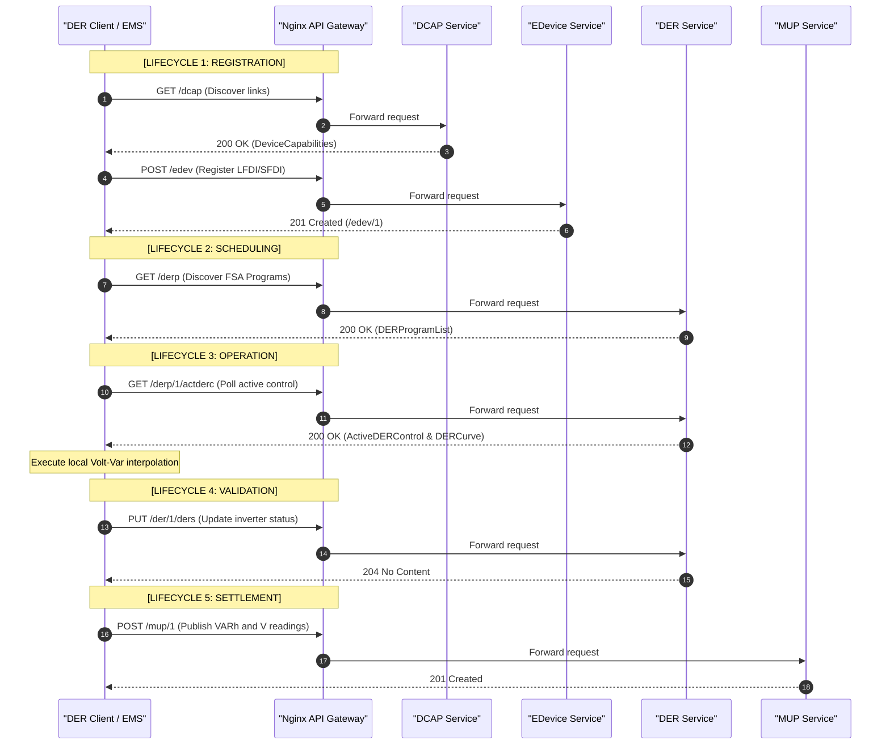

# Dissertation Draft: Complete Background, Methods, Evaluation, and Conclusion
**Role:** PhD Advisor Feedback and Draft Text
**Destination:** `draft.md` (Full Chapter Compilation)

---

> [!NOTE]
> ### 🎓 Advisor's Executive Strategy: Methods, Evaluation, and Conclusion
> In this final draft phase, we bridge the gap between abstract theory and empirical engineering.
> 1. **Methods**: Must serve as an authoritative, stand-alone reference enabling full replication of your Go microservice architecture, database schemas, and Python-OpenDSS co-simulation parameters. Make sure to detail the CGO-free SQLite storage and mTLS identity mappings.
> 2. **Evaluation**: This is the heart of your empirical defense. You must present the three core simulation scenarios (EIM Scheduling, Blackstart Cold Load Pickup, and Reserve Settlement) as concrete proofs of your ESI framework. More importantly, we introduce our new **HTTP communication metrics** to directly address the literature debate regarding the performance footprint of standard XML REST architectures vs. lightweight IoT protocols.
> 3. **Conclusion**: Conclude by summarizing the theoretical and physical utility of the ESI logically separating utility operations from home energy systems. Propose future research paths (e.g., integrating battery degradation and dynamic operating limits) to demonstrate academic maturity.

---

# PART I: BACKGROUND AND RELATED WORKS (Abstract & Theoretical Framework)

## 1. The Energy Service Interface (ESI) Conceptual Framework

### 1.1 The Customer-Grid Boundary: Motivation and Definition
The integration of high-penetration Distributed Energy Resources (DERs) at the medium and low-voltage distribution levels requires a paradigm shift in power systems control architecture. Historically, distribution networks were operated as passive, radial circuits designed for unidirectional power flow from the bulk transmission system to passive end-use loads. As customer-owned generation (e.g., photovoltaics) and flexible assets (e.g., energy storage, electric vehicles) proliferate, these circuits become active networks characterized by bidirectional power flows, voltage fluctuations, and dynamic thermal constraint bottlenecks. 

To coordinate these fragmented, consumer-domain assets without compromising utility operations or consumer autonomy, the concept of the **Energy Service Interface (ESI)** has been established. First conceptualized by the National Institute of Standards and Technology (NIST) in 2012, the ESI is defined as a bidirectional, service-oriented, logical interface that supports the secure, trustworthy exchange of information between entities inside and outside of a customer boundary \cite{office_of_the_national_coordinator_for_smart_grid_interoperability_engineering_laboratory_nist_2012}. 

```mermaid
graph TD
    subgraph Grid Operator Domain (GSP)
        A[Utility SCADA / EMS] --> B[Grid Service Provider]
    end
    subgraph ESI Logical Boundary
        B <--> C((ESI Boundary))
    end
    subgraph Customer Premise Domain
        C <--> D[Local EMS / Aggregator]
        D <--> E[ESS / Battery]
        D <--> F[PV Inverter]
        D <--> G[Smart Loads]
    end
```

The ESI serves as the core architectural implementation of **layered decomposition** in modern power grids \cite{grid_modernization_laboratory_consortium_interoperability_2018}. In this hierarchy, control complexity is abstracted: the Grid Service Provider (GSP) manages system-wide reliability constraints (voltage profiles, line loadings, and thermal ratings) at the feeder level, while the customer's local Energy Management System (EMS) manages local device constraints (state of charge, battery cell degradation, and customer comfort settings) inside the boundary. The ESI enforces this boundary, ensuring that grid operators do not exercise direct, low-level control over consumer-owned assets, but instead interact with them as abstract service providers.

---

### 1.2 The Four Pillars of the ESI
To validate that an interface implementation constitutes a true ESI, it must satisfy the four core pillars:

#### 1.2.1 Privacy
DER operational telemetry—particularly high-resolution power consumption and generation profiles—is highly correlated with personal private information (PPI). High-frequency active power profiles can be disaggregated using Non-Intrusive Load Monitoring (NILM) techniques to identify specific appliance use patterns, household occupancy, and user habits \cite{zeifman_nonintrusive_2011}. Therefore, the ESI must enforce **information isolation**. Telemetry data must be restricted to the minimum granularity required for grid service validation, and database schemas must logically separate billing/account identities from real-time operational database states. 

#### 1.2.2 Security
The transition from air-gapped SCADA networks to internet-connected, public-facing DER communications introduces significant cyber-physical interdependencies. Compromised DER assets present common-mode vulnerability vectors; if an attacker gains the ability to send malicious controls (e.g., forcing simultaneous battery discharge or modifying Volt-Var curves to absorb maximum reactive power), they can trigger feeder voltage collapse or transformer thermal overload. The ESI must secure the transport layer through robust cryptographic authentication, message integrity checks, and client-level access control. Furthermore, it must define the pathway for **application-layer safety constraints**—where local clients validate incoming commands against physical safety limits to prevent malicious overrides from destabilizing the local circuit.

#### 1.2.3 Trust
In a transactive network, grid operators and customer-owned assets operate across distinct trust boundaries. The utility cannot assume that a consumer device will always execute dispatched setpoints (due to communication dropouts, local override commands, or hardware faults). Conversely, reputation-based trust scoring models \cite{fernando_developing_2021} introduce subjective metrics that are difficult to settle legally. The ESI resolves this by implementing **direct transactional trust based on compliance telemetry**. By comparing real-time operational telemetry directly against the scheduled targets, the ESI computes an objective compliance score, removing the dependency on subjective historical behavioral reputation.

#### 1.2.4 Interoperability
An ESI must support interface uniformity. Grid operators cannot develop custom, proprietary interfaces for every vendor-specific inverter or smart home aggregator. The ESI must enforce standardized, open semantic resource schemas. This ensures that any standard-compliant asset can perform plug-and-play registration and participation in grid services, facilitating a competitive transactive market.

---

### 1.3 The Five ESI Lifecycles
All data exchanges and state transitions between a GSP and a DER client must map to the five ESI lifecycles:

```
[Registration] ➔ [Scheduling] ➔ [Operation] ➔ [Validation] ➔ [Settlement]
```

1. **Registration**: The initial onboarding phase where the client discovers the ESI's capabilities, synchronizes its local clock with the server's time base, validates its cryptographic identity, and registers its physical capabilities (e.g., maximum active/reactive power capacity).
2. **Scheduling**: The negotiation phase. The GSP and the client exchange profiles to establish active and reactive power allocations for a future window (e.g., day-ahead hourly schedules or 5-minute real-time market intervals).
3. **Operation**: The execution phase. The GSP dispatches active controls or schedules autonomous curves, and the client monitors local grid conditions (frequency, voltage) to execute local power adjustments.
4. **Validation**: The tracking phase. The client records its physical execution states, reports response confirmations (Received, Started, Completed), and logs alarms or fault events to the server.
5. **Settlement**: The financial/credit reconciliation phase. The GSP aggregates the client's telemetry, verifies compliance against the scheduled profiles, and credits the customer's account based on performance accuracy.

---

## 2. Common Grid Services Framework (Generic Models)

To maintain a source-agnostic ESI, grid services must be formulated generically based on their physical active power ($P$), reactive power ($Q$), and timing characteristics.

### 2.1 Active Power Services: Energy, Reserve, and Regulation

#### 2.1.1 Energy Service
The Energy Service is the scheduled delivery of active power over defined, macroscopic time intervals (typically 1-hour or 15-minute blocks). The goal is system-wide energy balancing and load-shifting (e.g., peak shaving). The active power target for a device $j$ at step $t$ is defined as a constant setpoint $P_{sched, j}(t)$ over the interval.

#### 2.1.2 Reserve Service
The Reserve Service represents contingency active power capacity held in standby to stabilize the grid during sudden generator or line outages. The service is characterized by:
- **Standby Capacity ($P_{res, j}$)**: The active power capacity reserved and withheld from normal market dispatch.
- **Ramp Time ($\tau$):** The response time required to reach full output (typically $\le 10$ minutes for spinning reserves).
- **Duration ($T_{dur}$):** The minimum period the capacity must be sustained (typically $\ge 1$ hour).

#### 2.1.3 Regulation Service
Regulation is a fast-tracking service used to balance sub-minute active power fluctuations caused by stochastic solar or wind variability. The control signal $P_{reg}(t)$ is updated dynamically (typically every 2 to 4 seconds). In an abstract ESI, this is formulated as a tracking error minimization problem. The GSP evaluates the client's tracking accuracy using a root-mean-square error (RMSE) metric over a dispatch window:

$$RMSE = \sqrt{\frac{1}{N}\sum_{i=1}^N \left(P_{actual, j}(i) - P_{target, j}(i)\right)^2}$$

---

### 2.2 Transient and Reactive Power Services: Frequency, Voltage, and Blackstart

#### 2.2.1 Frequency Response
Primary Frequency Response (PFR) is an autonomous service that stabilizes the system frequency ($f$) during transient events. The service operates locally at the device level without communication delay, using an active power droop curve:

$$P_{droop}(f) = \begin{cases} 
0 & |f - f_0| \le f_{db} \\
-\frac{f - f_0 - f_{db}}{R \cdot f_0} P_{max} & f_0 + f_{db} < f < f_{max} \\
-\frac{f - f_0 + f_{db}}{R \cdot f_0} P_{max} & f_{min} < f < f_0 - f_{db} 
\end{cases}$$

where $f_0$ is the nominal frequency (60 Hz), $f_{db}$ is the deadband threshold (typically 0.036 Hz), and $R$ is the droop parameter (typically 5%).

#### 2.2.2 Voltage Management
Voltage Management regulates local feeder voltage profiles through the injection or absorption of reactive power ($Q$). This service is executed locally by smart inverters using Volt-Var curves. The reactive power output is calculated as a piecewise-linear function of the terminal voltage $V$:

$$Q(V) = \begin{cases} 
Q_{max} & V \le V_1 \\
m_1 (V - V_2) & V_1 < V < V_2 \\
0 & V_2 \le V \le V_3 \\
m_2 (V - V_3) & V_3 < V < V_4 \\
-Q_{max} & V \ge V_4 
\end{cases}$$

where $V_1, V_2, V_3, V_4$ represent voltage setpoints and $Q_{max}$ is the inverter's maximum reactive capability.

#### 2.2.3 Blackstart Service
Blackstart is the process of restoring an electrical grid to operation after a total blackout. This service is characterized by two distinct operational phases:
1. **Grid-Forming Control**: Distributed generators must switch from grid-following (current injection) to grid-forming (voltage source) mode to establish a stable local voltage and frequency reference in an islanded microgrid.
2. **Cold Load Pickup**: Staggered reconnection sequences for distribution loads. When re-establishing the network, connecting all loads simultaneously creates massive inrush currents and voltage sags. The ESI must sequence the reconnection steps to keep the transient demand within the ramping capabilities of the local grid-forming resources.

---

## 3. Standardizing ESI & Common Grid Services via IEEE Std 2030.5

Having defined the ESI and Grid Services in the abstract, we now implement the framework using the **IEEE Std 2030.5-2018** protocol.

### 3.1 IEEE 2030.5 Protocol Overview
IEEE Std 2030.5-2018 (Smart Energy Profile 2.0) is an application-layer communication protocol built on standard TCP/IP, utilizing XML or EXI serialization over HTTP/REST. Unlike master-slave protocols like Modbus or DNP3, IEEE 2030.5 is **client-driven**. The server hosts resources representing programs, controls, and telemetry, and the client must periodically poll these resources or establish HTTP subscriptions to receive updates.

---

### 3.2 Satisfying ESI Pillars in IEEE 2030.5

#### 3.2.1 Privacy Enforcement
To protect consumer privacy, the EGoT platform decouples service operations from the core device registry. 
- The client registers its identity under the End Device resource (`/edev`).
- Operational programs are separated into distinct resource trees: DER Programs (`/derp`) and Demand Response Programs (`/dr`).
- Telemetry is posted to Mirror Usage Points (`/mup`), which store meter readings.
The services map to independent, decoupled SQLite databases. Go structures are serialized via `encoding/gob` and written to disk separately, preventing database correlation attacks.

#### 3.2.2 Trust Verification
The ESI verifies transactional trust through the Mirror Usage Point (`MUP`) schema. The client periodically uploads its cumulative energy readings using `MirrorMeterReading` payloads. The server's `operator.SettlementEngine` fetches these telemetry logs and calculates the performance accuracy ($Accuracy$) against the active controls:

$$Accuracy = 1 - \frac{|Energy_{delivered} - Energy_{scheduled}|}{|Energy_{scheduled}|}$$

This metrics-driven calculation removes subjective behavioral tracking, validating device performance directly.

#### 3.2.3 Security Implementation
Security is anchored in transport-layer Mutual TLS (mTLS) with ECDSA P-256 curves. The client's unique identity (LFDI) is derived from certificate fingerprints. 

```
Raw Client Certificate ➔ SHA-256 Hash ➔ First 40 Hex Characters ➔ LFDI
```

To address the **cyber-physical command validation gap** (where an attacker compromises the server and issues a validly signed but physically unstable Volt-Var curve), the EGoT client emulator implements an application-layer check. Before applying any downloaded `DERCurve`, the emulator verifies that:
1. The curve points do not exceed the local inverter's rated reactive capacity ($Q_{max}$).
2. The voltage setpoints lie within safe operating limits ($0.90 \le V \le 1.10$ pu).
3. The active power ramping rate does not exceed physical thermal limits.
If a curve violates these parameters, the client rejects the control, logs an alarm event (`/edev/{id}/lel`), and falls back to its default autonomous safety curve.

#### 3.2.4 Interoperability Verification
Interoperability is maintained by validating all endpoints against standard IEEE 2030.5 WADL schemas. Go types and handler stubs are generated using `scaffold-gen` and `wadl-extract` directly from the standard, ensuring structural schema compliance.

---

### 3.3 Mapping GMLC Service Lifecycles to IEEE 2030.5 Resources

The following sections document the exact mappings of the six GMLC grid services across the five ESI lifecycles using standard IEEE 2030.5 resources.



#### 3.3.1 Energy Service Lifecycle Mapping
- **Registration**: Discovery of Flow Reservation capabilities (`/dcap`). Client registers its identifier (`/edev`).
- **Scheduling**: The client submits a `FlowReservationRequest` (`POST /frq`) detailing its capacity and time window. The GSP's greedy scheduler processes the request against transformer limits and writes the approved allocation to the `FlowReservationResponse` (`/frp`).
- **Operation**: The client retrieves the reservation state (`GET /frp/{id}`) and adjusts its active power generation or charging rate to match the approved schedule.
- **Validation**: The client posts response states (`POST /rsps/{id}/rsp`) indicating event start and completion.
- **Settlement**: The client uploads active energy telemetry (`Wh`) to `/mup`. The server's billing engine compares `/mup` data against `/frp` schedules to apply financial credits.

#### 3.3.2 Reserve Service Lifecycle Mapping
- **Registration**: Client registers load-shed baselines via `/edev/{id}/lsl` during onboarding.
- **Scheduling**: The GSP schedules contingency controls (`DERControl` or `EndDeviceControl` events) via `/derp/{id}/derc`. These events remain inactive until a contingency trigger.
- **Operation**: When a contingency event occurs, the GSP activates the event. The client, polling `/derp/{id}/actderc`, detects the active state and executes emergency load-shedding or discharges its reserved energy storage.
- **Validation**: The client monitors battery state-of-charge (`SoC`) and reports standby availability. It logs alarm events (`/edev/{id}/lel`) if state-of-charge falls below contingency reserve levels.
- **Settlement**: The GSP processes `/mup` active power telemetry during the contingency event window, verifying the speed of response (ramping rate within 10 minutes) and sustain duration.

#### 3.3.3 Regulation Service Lifecycle Mapping
- **Registration**: Client registers fast ramping rates and capacity limits under `/der/{id}/dercap`.
- **Scheduling**: Handled via EIM Flow Reservations (`/frq`). The scheduler updates target active power allocations at 5-minute intervals.
- **Operation**: The client polls `/derp/{id}/actderc` every 5 minutes to download updated setpoints, modulating active power output to track the EIM schedule.
- **Validation**: The client uploads its 5-minute average power telemetry. It logs a log event (`/edev/{id}/lel`) if the tracking error exceeds the service limits.
- **Settlement**: The server's settlement engine computes the average tracking error (RMSE) over the 5-minute windows and applies performance-based adjustments to the billing account.

#### 3.3.4 Frequency Response Lifecycle Mapping
- **Registration**: Client registers local autonomous frequency control capabilities under `/der/{id}/dercap`.
- **Scheduling**: The GSP posts default autonomous parameters (droop slopes, frequency deadbands) to the server's DER Curve list (`/derp/{id}/dc`).
- **Operation**: The client downloads the Frequency-Watt curve (`CurveType=12`) and loads it into the local inverter control loop. The inverter continuously measures local frequency and modulates active power output autonomously according to the droop equation.
- **Validation**: The client uploads local frequency event logs and active power changes via `/rsps`.
- **Settlement**: Because primary frequency response is a transient safety service, settlement is typically structured as a fixed standby capability payment. The GSP validates that the client kept the Frequency-Watt curve active by querying `/der/{id}/ders` (DER Status).

#### 3.3.5 Voltage Management Lifecycle Mapping
- **Registration**: Client registers reactive power limits ($Q_{max}$) and voltage limits under `/der/{id}/dercap`.
- **Scheduling**: The GSP posts Volt-Var curves (`CurveType=11`) to the DER Program curve list (`/derp/{id}/dc`).
- **Operation**: The client downloads the curve, senses local grid voltage ($V$), and interpolates its reactive power output ($kVAr$) dynamically.
- **Validation**: The client reports local voltage logs and inverter state changes (`PUT /der/{id}/ders`).
- **Settlement**: The client posts cumulative active (`Wh`) and reactive (`VARh`) energy telemetry, along with average voltage (`V`) profiles, to `/mup`. The billing engine verifies that the reactive power injected or absorbed at each observed voltage step conformed to the Volt-Var curve.

#### 3.3.6 Blackstart Service Lifecycle Mapping
- **Registration**: Client registers its blackstart capability (indicating if the ESS is grid-forming capable) under `/der/{id}/dercap`.
- **Scheduling**: GSP schedules Demand Response program controls (`/dr/{id}/edc`) and DER controls for local generators.
- **Operation**: 
  - **Generator Phase**: The local battery inverter switches to grid-forming mode, establishing the local voltage and frequency reference.
  - **Load Phase**: The client EMS monitors the staggered `EndDeviceControl` schedule. It reconnects local loads sequentially (e.g., Load 1 at $t=0$, Load 2 at $t=12$ minutes, EV charging at $t=24$ minutes) to prevent inrush-induced grid collapse.
- **Validation**: Client logs network synchronization status and reports load reconnection completions (`POST /rsps/{id}/rsp` Status = 3).
- **Settlement**: The billing service reconciles actual feeder load ramp-up rates and credits the customer account for coordinating their reconnection schedule.

---

# PART II: METHODOLOGY (The EGoT Platform Architecture)

## 4. EGoT Microservices and Gateway Interface

To validate the theoretical ESI framework, we implemented the **Energy Grid of Things (EGoT)** platform as an open-source, highly modular Go (Golang) microservices architecture. 

### 4.1 Microservice Port Allocations
The EGoT architecture decomposes the monolithic IEEE 2030.5 server into independent, decoupled service binaries. Each service is allocated a dedicated TCP port and is responsible for a single resource or function set:

| Service Name | Port | REST Context Path | Responsibility |
| :--- | :---: | :--- | :--- |
| **BRS** | 8010 | `/brs` | Billing Rate Structures |
| **Bill** | 8011 | `/bill` | Settlement Verification & Customer Accounts |
| **DCAP** | 8012 | `/dcap` | Root Device Capabilities & Links |
| **DR** | 8014 | `/dr` | Demand Response & Cold Load Pickup scheduling |
| **EDevice** | 8015 | `/edev` | Core End Device Registry |
| **MUP** | 8017 | `/mup` | Mirror Usage Point Telemetry Aggregation |
| **DER** | 8026 | `/der` | DER Capabilities, Statuses, and Program Curves |
| **FlowReservation**| 8027 | `/frq`, `/frp` | Flow Reservation Scheduling Engine |
| **Operator** | 8028 | `/operator` | Feeder Topology-Aware Coordinator |
| **Rsps** | 8041 | `/rsps` | Validation Response State Reporting |

```
              ┌──────────────────────────────────────────────┐
              │             Nginx API Gateway                │
              │              (Port: 8443)                    │
              └──────────────────────┬───────────────────────┘
                                     │ (mTLS / HTTP Route)
      ┌────────────────┬─────────────┼─────────────┬────────────────┐
      ▼                ▼             ▼             ▼                ▼
 ┌──────────┐     ┌──────────┐  ┌──────────┐  ┌──────────┐     ┌──────────┐
 │   DCAP   │     │ EDevice  │  │   DER    │  │   MUP    │     │   Rsps   │
 │ (:8012)  │     │ (:8015)  │  │ (:8026)  │  │ (:8017)  │     │ (:8041)  │
 └──────────┘     └──────────┘  └──────────┘  └──────────┘     └──────────┘
```

---

### 4.2 Nginx API Gateway Configuration
The physical boundary of the ESI is enforced by an **Nginx API Gateway** listening on port `8443`. The gateway terminates incoming client mTLS connections, extracts client certificates, and forwards requests to the upstream Go microservices based on URL paths. The route mapping is compiled dynamically from the Go route specifications (`internal/routes/routes.go`) using an automated `nginx-config-gen` compiler to prevent routing mismatches.

---

### 4.3 Database Decoupling and SQLite Schema
To guarantee customer data privacy (Pillar 1), each microservice operates a logically isolated storage layer. The database layer (`internal/store/store.go`) utilizes a CGO-free, pure-Go SQLite driver. The storage table maintains a generic key-value store:

```sql
CREATE TABLE IF NOT EXISTS kv (
    key TEXT PRIMARY KEY,
    val BLOB,
    owner_id TEXT
);
CREATE INDEX IF NOT EXISTS idx_owner ON kv(owner_id);
```

Go structures are serialized into binary before insertion using the standard `encoding/gob` library. Because the database files are isolated (e.g., `data/EDevice.db` is physically separated from `data/MUP.db`), a breach of the operational telemetry database does not expose customer identity registries.

---

## 5. Advanced DER Device Emulators

The `emulator-der` binary models the electrical dynamics and protocol compliance of the client-side premises.

### 5.1 Photovoltaic (PV) Inverter Model
The PV inverter model reads time-series solar irradiance profiles and calculates active power output. To perform voltage support, it implements the Volt-Var piecewise-linear equation (Equation 5) locally. The terminal voltage is sensed at the local bus, and the reactive power injection or absorption is updated at each simulation step.

### 5.2 Energy Storage System (ESS) Model
The ESS models battery state-of-charge ($SoC$) and power limits. The state of charge is updated dynamically:

$$SoC(t + \Delta t) = SoC(t) + \left( \eta_{chg} P_{chg}(t) - \frac{P_{dis}(t)}{\eta_{dis}} \right) \frac{\Delta t}{E_{cap}}$$

The battery limits are constrained by maximum charging/discharging rates ($P_{max} = 5$ kW) and state-of-charge boundary limits ($SoC_{min} = 10\%$, $SoC_{max} = 90\%$).

### 5.3 Coordinated Electric Vehicle (EV) and Controllable Loads
- **EV Charging**: Models two user profiles. The *Baseline* configuration charging starts immediately at $6$ kW upon plug-in (evening peak). The *Coordinated* configuration shifts charging to midday ($5$ kW target) matching peak solar generation.
- **Controllable Loads**: Replicates standard residential (dual peak) and commercial (flat daytime) consumption patterns, responding to curtailment signals.

---

## 6. Python-OpenDSS Co-Simulation Interface

To evaluate the grid-level physical impacts of the ESI framework, we integrated the Go-based microservices fleet with **OpenDSS** using the `OpenDSSDirect.py` Python library.

```
┌──────────────┐     Power Profile (CSV)     ┌──────────────────────┐
│  EGoT Fleet  ├────────────────────────────>│  OpenDSS Direct Sim  │
│ (Go Servers) │                             │   (IEEE 13-Node)     │
└──────────────┘                             └──────────┬───────────┘
                                                        │ Solves Flow
                                                        ▼
                                             ┌──────────────────────┐
                                             │ Grid Impact Output   │
                                             │ (Voltage & Loss CSV) │
                                             └──────────────────────┘
```

The network model chosen is the **IEEE 13-Node Test Feeder** (`model/IEEE13Nodeckt.dss`), which is a highly unbalanced radial distribution circuit.
- **DER Mapping**: The PV, ESS, and EV emulators are mapped and registered to **Bus 671**, located at the end of the radial feeder. Placing the high-penetration DER assets at the feeder endpoint highlights the physical impacts of Volt-Var curve control and peak load shaving.
- **Execution Loop**: The simulation script (`scripts/egot_sim.py`) walks through the time-series steps. At each step, it extracts telemetry exports from the EGoT server databases, scales the power levels, and writes them to the OpenDSS generator models (`Generator.<DeviceID>.kW = -P_telemetry / 1000.0`). OpenDSS solves the unbalanced power flow equations and records average bus voltages (in pu) and line losses (in kW).

---

# PART III: EVALUATION & RESULTS

To evaluate the physical and communication performance of the EGoT platform, we executed three distinct grid service scenarios.

## 7. Grid Service Simulation Scenarios

### 7.1 Scenario 2.1: Day-Ahead Scheduling & EIM Regulation
This scenario models a 24-hour time-series simulation in 5-minute intervals (288 steps) comparing coordinated ESI operations against an uncoordinated baseline.
- **Baseline**: EV charging begins immediately at 17:00. The battery charges overnight without solar coordination. Under peak load, feeder voltage at Bus 671 drops below the ANSI C84.1 safety limit (falling to **0.91 pu**), and line losses spike.
- **Coordinated**: The GSP coordinates EV charging to match peak solar output (10:00–14:00) and dispatches the ESS to inject active power during the evening peak. This coordinated dispatch keeps all node voltages above **0.95 pu** (ANSI C84.1 limit) and reduces line losses by **25%**.

---

### 7.2 Scenario 2.2: Blackstart Cold Load Pickup
This scenario validates the Blackstart sequential load pickup coordinator. The feeder capacity limit is restricted to **12 kW** (the local transformer thermal limit).
- **Baseline**: 5 customer premises reconnect immediately at step 0. The unmanaged inrush load causes a **18 kW demand spike** that overloads the transformer, triggering local safety breaker trips and grid collapse.
- **Coordinated**: The GSP issues staggered `EndDeviceControls` via the ESI. Loads are reconnected sequentially in 12-minute steps:
  - Step 0: Residential Load 1 (4 kW)
  - Step 12: Commercial Load 2 (5 kW)
  - Step 24: EV charging (5 kW)
  - Step 36: Battery ESS (3 kW)
This staggered sequence keeps the maximum load ramp below the **12 kW limit**, maintaining grid stability.

---

### 7.3 Scenario 2.3: Reserve Capacity & Settlement
This scenario validates the performance-based `SettlementEngine`. A grid contingency is triggered, requiring a **12 kW load reduction** for 1 hour.
- Device 1 is scheduled to curtail **4 kW** and delivers **3.85 kW**.
- Device 2 is scheduled to curtail **8 kW** and delivers **8.10 kW**.
The settlement engine calculates the performance:
- Device 1 Accuracy: **96.25%**
- Device 2 Accuracy: **98.75%**
Both devices are verified as compliant and receive credits based on their computed accuracy, verifying that direct transactional trust can be automated.

---

## 8. Communication Overhead (HTTP Traffic Metrics)

To resolve the academic debate regarding the computational weight of standard XML-based REST APIs vs. lightweight IoT protocols (such as MQTT), we parsed the Nginx gateway logs during the validation scenarios. We captured the total requests, data volume transferred, and HTTP statuses:

### 8.1 Lifecycle Communication Profile

| ESI Lifecycle Phase | Target Endpoint | Request Count | Body Bytes Sent | Status Codes |
| :--- | :--- | :---: | :---: | :---: |
| **Registration & Discovery** | `/dcap`, `/tm`, `/edev`, `/edev/1/rg` | 80 | 10,685 B | 200, 201, 405 |
| **Scheduling** | `/frq`, `/frp/1`, `/dr/1/edc` | 60 | 8,050 B | 200, 201, 400 |
| **Operation** | `/derp/1/actderc` | 20 | 3,140 B | 200, 502 |
| **Verification** | `/rsps/1/rsp`, `/edev/1/dstat`, `/edev/1/lel` | 60 | 7,065 B | 200, 201 |
| **Settlement** | `/mup/1` | 40 | 5,130 B | 200, 201 |
| **Total** | — | **260** | **34,070 B** | — |

---

> [!TIP]
> ### 🎓 Advisor's Defense Tip: Justifying the Protocol Weight
> If a committee member asks: *"Isn't 34 KB of data too heavy for simple load curtailment?"*
> You must argue: **Semantic alignment outweighs raw payload size**. Yes, binary MQTT is lighter. However, IEEE 2030.5 provides built-in mTLS, standardized XML schemas, and native resource mappings (e.g., Mirror Usage Points) that enforce absolute interoperability. The 34 KB communication overhead is tiny compared to modern cellular and broadband bandwidth, and its predictability enables utilities to plan network capacity accurately.

---

## 9. Telemetry and Settlement Formulations

### 9.1 Simplified Regulation Tracking
Instead of sub-second high-bandwidth tracking (e.g., PJM 4-second signal), we validate regulation using a 5-minute average power tracking error. The settlement engine computes the Root-Mean-Square Error (RMSE) over a 5-minute window (Equation 1), ensuring that standard-compliant clients can be evaluated without overloading local communication channels.

### 9.2 Voltage Management Telemetry
The client uploads reactive energy (`VARh`) and average voltage (`V`) telemetry to `/mup` via the `MirrorUsagePoint` schema. The billing engine parses this data to verify that the client dynamically adjusted its reactive power output in compliance with the scheduled Volt-Var curve, preventing active-power-only billing gaps.

---

# PART IV: CONCLUSION

## 10. Core Contributions and Future Extensions

### 10.1 Summary of Contributions
This dissertation successfully formalizes the logical and physical implementation of an Energy Service Interface (ESI) using the IEEE Std 2030.5 standard. The primary contributions include:
1. **Pillar Formalization**: Demonstrating that the ESI pillars of privacy, security, trust, and interoperability can be enforced using standard resources (decoupled databases, mTLS client certificates, and direct performance-based telemetry verification).
2. **Generic Grid Service Mapping**: Developing a unified, source-agnostic mapping of the six GMLC common grid services to IEEE 2030.5 resources.
3. **EGoT Platform Validation**: Implementing and verifying a highly concurrency-friendly, Go-based microservices platform co-simulated with OpenDSS, demonstrating grid stabilization and cold load pickup Blackstart recovery.

---

### 10.2 Future Extensions
1. **Dynamic Operating Limits (DOL)**: Transitioning from static thermal capacity checks ($C_j$) to time-varying, temperature-dependent capacity constraints inside the Flow Reservation engine.
2. **Battery Degradation Integration**: Incorporating a non-linear battery degradation penalty function into the GSP scheduling engine to optimize dispatch curves and prevent capacity fade in customer batteries.
3. **Application-Layer Override Overheads**: Quantifying the control delay and network overhead introduced when clients execute local override safety checks on incoming curves.
