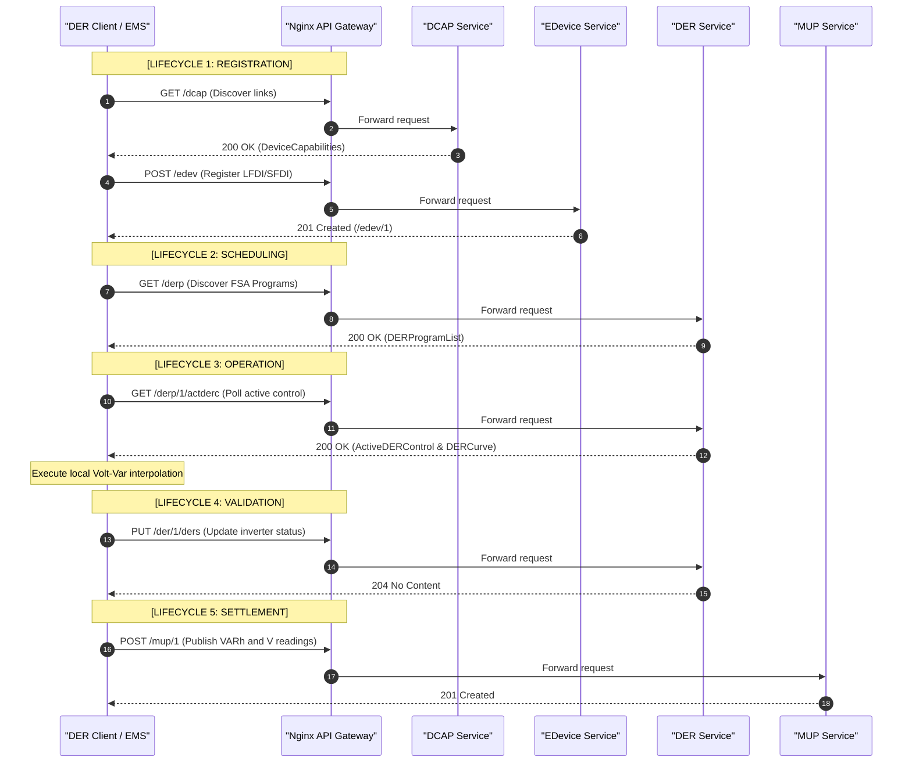

# Dissertation Draft: Complete Background, Methods, Evaluation, and Conclusion
**Role:** PhD Advisor Feedback and Draft Text
**Destination:** `draft.md` (Full Chapter Compilation)

---

> [!NOTE]
> ### 🎓 Advisor's Executive Strategy: Methods, Evaluation, and Conclusion
> In this final draft phase, we bridge the gap between abstract theory and empirical engineering.
> 1. **Methods**: Must serve as an authoritative, stand-alone reference enabling full replication of your Go microservice architecture, database schemas, and Python-OpenDSS co-simulation parameters. Make sure to detail the CGO-free SQLite storage and mTLS identity mappings.
> 2. **Evaluation**: This is the heart of your empirical defense. You must present the three core simulation scenarios (EIM Scheduling, Blackstart Cold Load Pickup, and Reserve Settlement) as concrete proofs of your ESI framework. More importantly, we introduce our new **HTTP communication metrics** to directly address the literature debate regarding the performance footprint of standard XML REST architectures vs. lightweight IoT protocols.
> 3. **Conclusion**: Conclude by summarizing the theoretical and physical utility of the ESI logically separating utility operations from home energy systems. Propose future research paths (e.g., integrating battery degradation and dynamic operating limits) to demonstrate academic maturity.

---

# PART I: BACKGROUND AND RELATED WORKS (Abstract & Theoretical Framework)

## 1. The Energy Service Interface (ESI) Conceptual Framework

### 1.1 The Customer-Grid Boundary: Motivation and Definition
The integration of high-penetration Distributed Energy Resources (DERs) at the medium and low-voltage distribution levels requires a paradigm shift in power systems control architecture. Historically, distribution networks were operated as passive, radial circuits designed for unidirectional power flow from the bulk transmission system to passive end-use loads. As customer-owned generation (e.g., photovoltaics) and flexible assets (e.g., energy storage, electric vehicles) proliferate, these circuits become active networks characterized by bidirectional power flows, voltage fluctuations, and dynamic thermal constraint bottlenecks. 

To coordinate these fragmented, consumer-domain assets without compromising utility operations or consumer autonomy, the concept of the **Energy Service Interface (ESI)** has been established. First conceptualized by the National Institute of Standards and Technology (NIST) in 2012, the ESI is defined as a bidirectional, service-oriented, logical interface that supports the secure, trustworthy exchange of information between entities inside and outside of a customer boundary \cite{office_of_the_national_coordinator_for_smart_grid_interoperability_engineering_laboratory_nist_2012}. 

```mermaid
graph TD
    subgraph Grid Operator Domain (GSP)
        A[Utility SCADA / EMS] --> B[Grid Service Provider]
    end
    subgraph ESI Logical Boundary
        B <--> C((ESI Boundary))
    end
    subgraph Customer Premise Domain
        C <--> D[Local EMS / Aggregator]
        D <--> E[ESS / Battery]
        D <--> F[PV Inverter]
        D <--> G[Smart Loads]
    end
```

The ESI serves as the core architectural implementation of **layered decomposition** in modern power grids \cite{grid_modernization_laboratory_consortium_interoperability_2018}. In this hierarchy, control complexity is abstracted: the Grid Service Provider (GSP) manages system-wide reliability constraints (voltage profiles, line loadings, and thermal ratings) at the feeder level, while the customer's local Energy Management System (EMS) manages local device constraints (state of charge, battery cell degradation, and customer comfort settings) inside the boundary. The ESI enforces this boundary, ensuring that grid operators do not exercise direct, low-level control over consumer-owned assets, but instead interact with them as abstract service providers.

---

### 1.2 The Four Pillars of the ESI and their Technical Tenets
To validate that an interface implementation constitutes a true ESI, it must satisfy four core pillars: Privacy, Security, Trust, and Interoperability. While these pillars define the conceptual goals of the customer-grid boundary, their practical enforcement is governed by eight fundamental architectural tenets outlined by the Grid Modernization Laboratory Consortium (GMLC) \cite{brown_guide_2024}:

1. **Service-Oriented Interface:** The interface communicates *what* physical service is needed, not *how* to deliver it.
2. **Device Agnosticism:** ESI services target abstract capabilities, never specific device classes or vendor-specific technologies.
3. **Provider-Side Aggregation:** The provider coordinates and abstracts all internal devices, exposing only a single, collective capacity at the connection point.
4. **Precisely Two-Party Contracts:** All ESI agreements exist between exactly two actors (the requestor and the provider). Multi-party interactions are decomposed into nested, pairwise relationships.
5. **Contractual Codification:** Provision of services is codified by formal, contract-like agreements specifying obligations, performance margins, and penalties.
6. **Information Privacy Preservation:** The internal objectives of the requestor and the low-level means/procurement values of the provider are never shared across the ESI.
7. **Hierarchical and Distributed Control:** The ESI naturally supports recursive nesting, where a service provider can act as a requestor for a downstream ESI.
8. **Interoperable Decidability:** Qualifications and terms are represented in machine-decipherable formats that resolve deterministically.

The mapping of these tenets to the four ESI pillars is structured as follows:

#### 1.2.1 Privacy
DER operational telemetry is highly correlated with personal private information (PPI). High-frequency active power profiles can be disaggregated using Non-Intrusive Load Monitoring (NILM) techniques to identify user habits and household occupancy \cite{zeifman_nonintrusive_2011}. Privacy can be protected at the boundary through cryptographic methods or via physical load-shaping using local energy storage systems to mask consumption signatures \cite{kement_privacy_2021}. The ESI enforces **information isolation** by implementing the tenets of **Asset Privacy** and **Device Agnosticism**. The low-level asset states, device counts, and topologies remain hidden; the GSP only sees a unified, aggregated capability curve at the electrical point of connection. Database schemas must physically decouple consumer account registries from operational telemetry databases to prevent correlation attacks.

#### 1.2.2 Security
The transition to public-facing, internet-connected DER communications introduces major cyber-physical vulnerabilities. Compromised assets can act as common-mode attack vectors (e.g., simultaneous battery discharges triggering feeder collapse). ESI security is anchored in the **Precisely Two-Party Contract** and **Hierarchical Control** tenets. While standard security architectures rely on transport security such as Mutual TLS (mTLS), these mechanisms are blind to application-layer content. If the utility's command systems are compromised, an attacker can broadcast validly signed, standard-compliant controls (e.g., incorrect Volt-Var curves) that can trigger immediate voltage collapse on low-voltage circuits \cite{sarker_cyber-physical_2020}. Thus, the ESI must enforce **cyber-physical safety constraints** at the client application layer \cite{alsaid_privacy-preserving_2022}. Local clients parse and validate incoming curves against local physical safety boundaries (e.g., thermal ratings and voltage limits) to reject destabilizing commands, falling back to default safety curves in case of violation.

#### 1.2.3 Trust
In active distribution grids, GSPs and customers operate across distinct commercial boundaries. GSPs cannot assume devices will execute dispatched setpoints due to overrides or communications faults. Conversely, subjective reputation scoring models \cite{fernando_developing_2021} are difficult to enforce legally. The ESI establishes **direct transactional trust** using **Contractual Codification** and **Interoperable Decidability**. By comparing real-time operational telemetry against negotiated performance variables, the GSP automatically computes objective, metrics-based compliance scores, removing the need for historical reputation tracking.

#### 1.2.4 Interoperability
GSPs cannot build custom, proprietary interfaces for every vendor-specific inverter or smart home aggregator. Interoperability is achieved via **Service-Oriented Interfaces** and **Device Agnosticism**. The ESI exposes open, standardized semantic resource schemas. Any asset meeting the physical performance criteria can register and participate in grid services in a plug-and-play manner, fostering open competition.

---

### 1.3 The ESI Behavioral Layers and the Five Lifecycles
All communications and transactions across the ESI must conform to **Five ESI Lifecycles**: **Registration, Scheduling, Operation, Validation, and Settlement**. Rather than executing as a flat, sequential process, these lifecycles are grouped and governed by **Three Behavioral Layers**—the **Discovery, Agreement, and Service Layers**—which define the architectural states and transitions of the customer-grid interface \cite{hammerstrom_architecture_2024}:

```
   ESI Behavioral Layers                     ESI Lifecycle Phases
┌─────────────────────────┐              ┌───────────────────────────┐
│     Discovery Layer     │ ──────────>  │                           │
├─────────────────────────┤              │        Registration       │
│     Agreement Layer     │ ──────────>  │                           │
├─────────────────────────┤              ├───────────────────────────┤
│                         │              │          Scheduling       │
│                         │              ├───────────────────────────┤
│                         │              │          Operation        │
│      Service Layer      │ ──────────>  ├───────────────────────────┤
│                         │              │          Validation       │
│                         │              ├───────────────────────────┤
│                         │              │          Settlement       │
└─────────────────────────┘              └───────────────────────────┘
```

#### 1.3.1 The Discovery and Agreement Layers: Setting up Registration
The **Discovery Layer** handles how the client and the ESI server find each other. Unlike standard web services, ESI discovery is physically constrained; the provider must reside on the target electrical region (feeder or substation) of the requestor to provide local grid support. During this setup, a default agreement of **"None—No Service"** is assigned, permitting communication initialization without creating immediate operational or financial obligations.

The **Agreement Layer** manages the contract negotiation process, corresponding to GMLC's **Registration** phase:
1. **Prequalification Verification:** The requestor advertises a specialized ESI service agreement template (derived from the 6 common services and modeled after the **Web Services Agreement [WS-Agreement]** specification).
2. **Deterministic Qualification:** The provider imports the template, evaluates its own capability parameters against the template's **Agreement Creation Constraints** (using deterministic Boolean expression trees), fills in its variables, and resubmits it as a *Pending ESI Service Agreement*.
3. **Contract Activation:** Once approved by the requestor, the contract becomes **Active (In Force)**, defining the service terms, quality of service (QoS) guarantees, rewards, and penalties.

#### 1.3.2 The Service Layer: Scheduling, Operation, Validation, and Settlement
Once a contract is in force, the ESI transitions to the **Service Layer**, which governs the remaining four operational lifecycles through the execution of **Service Events**:

1. **Scheduling Lifecycle:** The requestor and provider establish active and reactive power profiles for future intervals (e.g., day-ahead or 5-minute EIM windows), moving the service event into the *Scheduled or Armed* state.
2. **Operation Lifecycle:** When the scheduled interval begins or a contingency event is triggered, the service event enters the *Operate* state. The provider coordinates local DERs to deliver the active or reactive setpoint or execute autonomous droop settings.
3. **Validation Lifecycle:** The service event enters the *Measured and Verified (M&V)* state. The client logs physical telemetry records (confirmations, alarms, and power measurements) and uploads them to the server's validation endpoints (e.g., `/rsps` and `/mup`). This allows the requestor to verify physical compliance with the scheduled performance targets.
4. **Settlement Lifecycle:** The service event enters the *Settled* state. The server's billing engine compares the uploaded telemetry against the scheduled targets to calculate objective compliance scores, executing financial transfers (payments or penalties) in accordance with the codified ESI contract.

## 2. Common Grid Services Framework (Generic Models)
To maintain a source-agnostic and interoperable Energy Services Interface (ESI), grid-DER services must be formulated generically based on their physical active power ($P$), reactive power ($Q$), and timing characteristics, rather than the GSP's internal operational objectives \cite{kolln_terms_2023}. Each service is characterized by performance expectations, which combine electrical attributes (what is delivered), timing attributes (when and how fast it is delivered), and performance measurements (how it is quantified).

### 2.1 Active Power Services: Energy, Reserve, and Regulation

#### 2.1.1 Energy Service
The Energy Service is the scheduled delivery or consumption of active power over defined, macroscopic time intervals (typically 1-hour, 15-minute, or 5-minute blocks). The physical objective is macroscopic supply-demand balancing and load shifting. 
* **Electrical Attributes:** 
  * *Power:* Active power level $P(t)$ (kW or MW) for production (positive) or consumption (negative) over the performance period.
  * *Energy:* Total energy quantity $E$ (kWh or MWh) delivered.
  * *Electrical Location:* The physical injection/withdrawal node or zones in the grid.
* **Timing Attributes:** Start time, end time, and delivery schedule notification (publishing of market clearing or dispatch schedules).
* **Performance Measurement:** Revenue-grade interval meters measure net energy flow. For demand-side flexibility, performance is evaluated relative to a calculated baseline schedule $P_{base}(t)$ derived from historical consumption averages:
  $$P_{actual}(t) = P_{measured}(t) - P_{base}(t)$$

#### 2.1.2 Reserve Service
The Reserve Service represents standby active power capacity held on-call to stabilize the grid during contingency events (e.g., generator or transmission line outages). The service has two operational modes: a standby booking state and an active dispatch state.
* **Electrical Attributes:** 
  * *Standby Capacity ($P_{res}$):* The maximum active power capacity (kW or MW) held in reserve.
  * *Available Energy:* The total capacity (kWh) that can be sustained once dispatched.
* **Timing Attributes:** 
  * *Delivery Schedule:* Availability window (e.g., daily or hourly blocks).
  * *Speed of Response:* The ramp time ($\tau_{ramp}$) required to reach full reserve output once a contingency dispatch signal is received (typically $\le 10$ minutes for spinning reserves, $\le 30$ minutes for non-spinning reserves).
  * *Duration ($T_{dur}$):* The minimum period the capacity must be sustained (typically $\ge 1$ hour).
* **Performance Measurement:** Verified by logging the exact timestamp of the contingency dispatch signal $t_{dispatch}$ and the device's output $P_{actual}(t)$. Performance requires that the reserve capacity is fully active by $t_{dispatch} + \tau_{ramp}$ and sustained for $T_{dur}$.

#### 2.1.3 Regulation Service
Regulation is a high-speed tracking service used to balance rapid, sub-minute fluctuations in system frequency and area control error (ACE) caused by stochastic renewable generation. The GSP dispatches a dynamic setpoint $P_{target}(t)$ updated every 2 to 4 seconds.
* **Electrical Attributes:**
  * *Power Regulation Range:* The upper and lower active power boundaries ($[P_{min}, P_{max}]$) committed to tracking.
  * *Power Mileage ($M$):* The sum of absolute active power level movements over a delivery interval $[0, T]$, which measures the total physical control effort:
    $$M = \sum_{t=1}^T |P_{actual}(t) - P_{actual}(t-1)|$$
* **Performance Measurement:** Telmetry is recorded at the sub-second scale to match the dispatch signal. The service provider's performance is quantified using a multi-component **Performance Score ($S_{perf}$)**, valued between $0.0$ and $1.0$, which averages three components (Correlation, Delay, and Precision):
  $$S_{perf} = \frac{S_{corr} + S_{delay} + S_{prec}}{3}$$
  * *Correlation ($S_{corr}$):* Measures the phase alignment between the target signal and the response.
  * *Delay ($S_{delay}$):* Measures the time lag (in seconds) between signal dispatch and resource actuation.
  * *Precision ($S_{prec}$):* Evaluates the absolute tracking error:
    $$S_{prec} = 1 - \frac{\sum_{t=1}^T |P_{actual}(t) - P_{target}(t)|}{\sum_{t=1}^T P_{target}(t)}$$

---

### 2.2 Transient and Reactive Power Services: Frequency, Voltage, and Blackstart

#### 2.2.1 Frequency Response
Primary Frequency Response (PFR) is an autonomous service that stabilizes the system frequency ($f$) during transient events. The service operates locally at the device level without communication delay, using an active power droop curve:
* **Electrical Attributes:**
  * *Percent Droop ($R$):* The proportional gain defining the power change relative to frequency deviation (typically $R = 5\%$).
  * *Deadband ($f_{db}$):* The frequency threshold around the nominal frequency ($f_0 = 60$ Hz) within which the resource remains idle (typically $f_{db} = 0.036$ Hz).
  * *Active Power Output ($P_{droop}$):*
    $$P_{droop}(f) = \begin{cases} 
    0 & |f - f_0| \le f_{db} \\
    -\frac{f - f_0 - f_{db}}{R \cdot f_0} P_{max} & f_0 + f_{db} < f < f_{max} \\
    -\frac{f - f_0 + f_{db}}{R \cdot f_0} P_{max} & f_{min} < f < f_0 - f_{db} 
    \end{cases}$$
* **Performance Measurement:** Verification is performed post-event using high-resolution local frequency and power logs (sub-second sampling). The evaluation uses a three-step process:
  1. *Sample Validation:* Filtering logs to ensure data integrity during the frequency disturbance.
  2. *Response Type Classification:* Distinguishing inertial response (instantaneous, proportional to $df/dt$) from governor-style droop response.
  3. *Droop Verification:* Confirming that the active power output during the initial response window ($t_{dispatch} + 2$ to $10$ seconds) and sustained response window ($t_{dispatch} + 10$ to $30$ seconds) met the programmed droop slope within acceptable tolerance.

#### 2.2.2 Voltage Management
Voltage Management regulates local feeder voltage profiles through the injection or absorption of reactive power ($Q$). This service is executed locally by smart inverters using Volt-Var or Volt-Watt curves \cite{bello_optimal_2017, iioka_appropriate_2022}. These autonomous curves must be carefully parameterized to prevent control hunting or voltage oscillations on highly active distribution circuits \cite{dharmawardena_distributed_2022, smith_analysis_2016}. Additionally, the assumption of a constant load power factor in voltage simulations can introduce significant power flow errors, requiring per-phase active and reactive telemetry for accurate voltage modeling \cite{azzolini_analysis_2022}.
* **Electrical Attributes:**
  * *Target Voltage Range:* The upper and lower terminal voltage thresholds ($[V_{min}, V_{max}]$) in per-unit (pu).
  * *Reactive Capability:* Lagging (inductive, absorbing reactive power) and leading (capacitive, injecting reactive power) limits ($Q_{max}$).
  * *Reactive Power Output ($Q(V)$):*
    $$Q(V) = \begin{cases} 
    Q_{max} & V \le V_1 \\
    m_1 (V - V_2) & V_1 < V < V_2 \\
    0 & V_2 \le V \le V_3 \\
    m_2 (V - V_3) & V_3 < V < V_4 \\
    -Q_{max} & V \ge V_4 
    \end{cases}$$
* **Performance Measurement:** Verified by logging active power ($P$), reactive power ($Q$), and root-mean-square (RMS) bus voltage ($V$). M&V checks that the reactive power injected or absorbed at each observed voltage step conformed to the Volt-Var curve slope:
  $$m_1 = \frac{Q_{max}}{V_1 - V_2}, \quad m_2 = \frac{-Q_{max}}{V_4 - V_3}$$

#### 2.2.3 Blackstart Service
Blackstart is the process of restoring an electrical grid to operation after a total blackout without relying on external transmission grid power.
* **Electrical & Control Attributes:**
  * *Grid-Forming (GFM) Control:* The local resource must operate as a low-impedance voltage source, establishing and maintaining the system voltage magnitude ($V_0$) and frequency reference ($f_0$) dynamically, balancing transient load changes.
  * *Power Regulation Range:* The maximum real and reactive power changes the GFM inverter can absorb or supply during transient load pickup steps.
* **Timing & Execution Attributes:**
  * *Independent Start Capability:* The resource must demonstrate starting and energizing a dead bus without external power.
  * *Staggered Cold Load Reconnection:* Reconnecting customer feeder circuits sequentially to prevent inrush-induced voltage sags or transformer overload. The reconnection schedule is bounded by:
    $$P_{total}(t) = \sum_{k} P_{load, k}(t - t_k) \le P_{GFM, max}$$
    where $t_k$ represents the staggered time steps (e.g. $t_0 = 0$, $t_1 = 12$ min, $t_2 = 24$ min) designed to allow transients to settle before subsequent circuit connections.
* **Performance Measurement:** Compliance tests verify that the resource successfully started, energized the dead bus, and maintained voltage and frequency within safety limits ($0.95 \le V \le 1.05$ pu; $59.5 \le f \le 60.5$ Hz) during the staggered load pickup steps.

---

## 3. Standardizing ESI & Common Grid Services via IEEE Std 2030.5

Having defined the ESI and Grid Services in the abstract, we now implement the framework using the **IEEE Std 2030.5-2018** protocol.

### 3.1 IEEE 2030.5 Protocol Overview
IEEE Std 2030.5-2018 (Smart Energy Profile 2.0) is an application-layer communication protocol built on standard TCP/IP, utilizing XML or EXI serialization over HTTP/REST. Unlike master-slave protocols like Modbus or DNP3, IEEE 2030.5 is **client-driven**. The server hosts resources representing programs, controls, and telemetry, and the client must periodically poll these resources or establish HTTP subscriptions to receive updates.

---

### 3.2 Satisfying ESI Pillars in IEEE 2030.5

The core architectural pillars of the Energy Service Interface (ESI)—Privacy, Trust, Security, and Interoperability—must be mapped directly to the specifications of the IEEE 2030.5 standard. Below, we conduct a rigorous compliance audit of these pillars against the extracted standard requirements, identifying structural vulnerabilities, policy contradictions, and the engineering blueprints necessary to achieve production-grade compliance.

#### 3.2.1 Privacy Enforcement & Telemetry Anonymization
To protect consumer privacy, the EGoT platform decouples service operations from the core device registry. However, mapping this design to the standard reveals critical tension between telemetry mapping and tracking prevention:

*   **Standard Mapping (Constraints):**
    *   `REQ-015` (Clause 2): Mandates independent evaluation of data privacy and ownership.
    *   `REQ-137` (Clause 6.3.3): Restricts the use of the Short Device Identifier (SFDI) in a global context without domain qualification to prevent cross-domain client tracking.
    *   `REQ-869` (Clause 10.10.4.4.1): Mandates that the cryptographically unique Long Device Identifier (LFDI) *shall* be used directly in the creation of its associated `UsagePoint` or `MirrorUsagePoint` telemetry resources.
*   **Standard Contradictions & Vulnerabilities:**
    *   *The Identity-Telemetry Coupling Vulnerability:* While `REQ-137` attempts to prevent client tracking, `REQ-869` forces a hard bind between the immutable cryptographic certificate fingerprint (LFDI) and the high-resolution power consumption or generation profiles (`MirrorUsagePoint`). Anyone with access to the telemetry database or network streams can correlate real-time household behavior patterns directly to a physical device certificate.
    *   *The Network PIN Exposure Loophole (`REQ-145` vs `REQ-147`):* Exposing device-specific registration PINs over standard HTTP GET resources enables credential scraping, creating an onboarding vulnerability.
*   **ESI Implementation Blueprint:**
    *   *Decouple Telemetry from Cryptographic IDs:* Replace raw LFDIs in the `MirrorUsagePoint` (MUP) microservice payloads with rotating, ephemeral UUID pseudonyms, keeping the identity association inside a secure, offline database.
    *   *Apply Facility-Level Telemetry Aggregation:* Enforce ESI boundaries by aggregating individual asset telemetry (PV, ESS, loads) at the customer premises gateway before exporting data to the grid service provider.
    *   *Disable Network PIN Exposure:* Reject standard network-based registration PIN requests (`REQ-145` bypass). Enforce out-of-band PIN verification during hardware installation and disable the PIN upon completion.
    *   *Hardware-Backed Key Protection (`REQ-279`):* Ensure that all private keys are embedded in non-exportable hardware-backed storage (TPM 2.0 or secure chips).

#### 3.2.2 Trust Verification & PKI Boundaries
The ESI verifies transactional trust through the Mirror Usage Point (`MUP`) schema. In a decentralized smart grid, trust must be bidirectionally verified, yet the standard's certificate management rules present unique challenges:

*   **Standard Mapping (Constraints):**
    *   `REQ-159`/`161`/`163` (Clause 6.5): Mandates bidirectional authentication during the TLS handshake, requiring both server and client (if it possesses a cert) to validate device certificates.
    *   `REQ-208` (Clause 6.11.3.1): Recommends a single Smart Energy Root Certificate Authority (SERCA) to anchor the Manufacturing PKI.
    *   `REQ-229`/`230` (Clause 6.11.3.2): Prohibits the issuance of Certificate Revocation Lists (CRLs) or the operation of OCSP responders for the Manufacturing PKI due to the permanent embedding and indefinite lifetimes of device certificates.
*   **Standard Contradictions & Vulnerabilities:**
    *   *The Revocation-Free Trust Hole (`REQ-230` vs `REQ-163`):* Since standard PKI revocation mechanisms (CRLs/OCSP) are prohibited, a compromised device's certificate remains cryptographically valid indefinitely. The transport-layer handshake alone is insufficient to verify trust. Revocation management must be pushed to the application layer, forcing the ESI server to maintain and query a list of revoked client LFDIs on every request.
    *   *The Static Registration PIN Vulnerability:* Hardcoded registration PIN codes (such as the default `111115`) allow any rogue device presenting a valid certificate to complete onboarding, bypassing true physical authorization checks and violating the requirement that PINs must be random and unique per-device (`REQ-146`).
*   **ESI Implementation Blueprint:**
    *   *Enforce Application-Layer LFDI Blacklisting:* Maintain a real-time LFDI blacklist database on the server. On every API request, the server must extract the client's LFDI from the TLS session state and reject the connection if listed, mitigating the lack of CRLs.
    *   *Strict OID and Constraint Handshake Verification:* Configure the TLS listener (`tlsutil`) to verify that the client certificate chain terminates in the official SERCA (`REQ-208`) and contains the specific policy OID (`1.3.6.1.4.1.37244.1.1` for IEEE 2030.5 device certificates).
    *   *Dynamic PIN Generation in EDevice:* Replace static PIN handlers with an endpoint that generates secure, random, device-unique PINs (comprising 5 digits plus a modulo-10 checksum) and verifies them during registration.

#### 3.2.3 Security Implementation & mTLS Constraints
Application-layer security and authorization rules establish the boundary parameters, protecting both the grid from rogue control curves and client devices from command injection:

*   **Standard Mapping (Constraints):**
    *   `REQ-129` (Clause 6.1): Mandates that application-layer security features *shall* be used over all network types.
    *   `REQ-130` (Clause 6.1): Permits flexibility by not mandating a specific access control or security policy.
    *   `REQ-166` (Clause 6.5): Allows bypassing client TLS authentication or executing secondary client authentication after the handshake if the local security policy permits.
    *   `REQ-182` (Clause 6.8): Recommends that servers support multiple security policies to satisfy different service providers.
    *   `REQ-191` (Clause 6.9.2): Mandates that authorization *shall* occur upon registration, setting Access Control Lists (ACLs) based on security policy and the client's presence in `aclLocalRegistrationList`.
*   **Standard Contradictions & Vulnerabilities:**
    *   *The Policy Mandate Contradiction (`REQ-129` vs `REQ-130`):* By declaring that security features are mandatory (`REQ-129`) but refusing to standardize access control policies (`REQ-130`), the standard risks interoperability failures where conformant devices are rejected by custom local policies.
    *   *The Client Bypass Security Loophole:* Bypassing client certificates at the TLS handshake (`REQ-166`) forces the server to accept and parse unauthenticated HTTP/XML request payloads. This exposes the microservice routing and parsing stack to Denial of Service (DoS) attacks and XML external entity injection before identity can be verified.
*   **ESI Implementation Blueprint:**
    *   *Reject mTLS Bypasses (Strict mTLS):* Disable client authentication bypasses. Require client certificate validation on all endpoints, discarding the secondary authentication option in `REQ-166`.
    *   *Dynamic ACL Binding (`REQ-191`):* Map client LFDIs extracted during the TLS handshake to their corresponding resources in the database. Implement strict local ACL checks on all resources (e.g. `/derp/{id}/actderc`), verifying that the caller's SFDI has explicit access.
    *   *Multi-Policy Network Isolation:* Implement virtual host routing at the API Gateway (Nginx) to isolate different security policy profiles. This prevents weaker client policies from degrading security on critical high-performance DER interfaces.

#### 3.2.4 Interoperability Verification & Event Scheduling
Grid services rely on deterministic scheduling and event execution. The standard defines complex rules for resolving overlapping controls and managing primacy, introducing latency and sequencing challenges:

*   **Standard Mapping (Constraints):**
    *   `REQ-578`/`580` (Clause 10.2.2.3): Mandates that clients poll event lists and active status changes at the less frequent of 15 minutes or the resource's `pollRate`.
    *   `REQ-582`/`583` (Clause 10.2.2.3): Prohibits editing events (except for status changes) and mandates that servers cancel events or issue superseding events.
    *   `REQ-596`/`597`/`598` (Clause 10.2.2.3): Mandates that clients adjust the duration of overlapped events when an overlap is detected, shortening the old event or shifting its start time based on effective boundaries.
    *   `REQ-613` (Clause 10.2.2.3) & `REQ-655`/`656`/`657` (Clause 10.2.4.6): Mandates that conflicting control modes execute according to primacy order, falling back to the latest `creationTime` if primacy is equal.
*   **Standard Contradictions & Vulnerabilities:**
    *   *The Polling Latency Loophole (`REQ-578` vs `REQ-596`):* Relying on a 15-minute polling interval to discover events means client devices will fail to detect emergency controls (e.g., fast active power curtailment) in real-time. This latency breaks the grid's ability to execute fast frequency or voltage stabilization.
    *   *The Primacy Self-Selection Conflict (`REQ-660` vs `REQ-613`):* Recommending that servers self-select their primacy values can lead to situations where competing third-party aggregators claim the same highest primacy level (`0`). The client is forced to resolve overlaps based solely on the event's `creationTime` (`REQ-613`), resulting in non-deterministic control behavior dependent on upload timing rather than grid safety requirements.
*   **ESI Implementation Blueprint:**
    *   *Enforce Server-Sent Events (SSE) Subscriptions:* Bypass the polling latency limit (`REQ-578`) by establishing persistent SSE connections to `/derp/{id}/actderc` for real-time control updates.
    *   *Stateful Event Scheduler & Duration Truncation:* Implement a local scheduling queue on the client emulator that applies duration truncation logic. If a new event with equal or higher primacy overlaps, shorten the existing event (`REQ-597`) or split and queue the remaining non-overlapping segments (`REQ-598`).
    *   *Sanitize Primacy Configuration at the ESI Gateway:* Override declared primacy values at the API gateway level based on local regulatory hierarchies (e.g., Local Utility (Primacy 0) > Aggregator (Primacy 1) > Consumer (Primacy 2)), preventing self-selection conflicts.
    *   *Strict Clock Drift Enforcement:* Enforce clock sync via the Time service (`/tm`). If the emulator detects a clock drift of $\Delta t \ge 2$ seconds, it must abort event execution and log an alarm, preventing scheduling overlap math failures.


---

### 3.3 The Device-Agnostic Conflict in IEEE Std 2030.5

A critical tension exists between the architectural tenets of the Energy Service Interface (ESI) and the concrete schemas defined in the IEEE Std 2030.5-2018 standard. ESI Tenet 2 (Device Agnosticism) dictates that grid-facing service requests must target abstract capabilities and remain completely indifferent to the specific physical class or vendor of the underlying Distributed Energy Resource (DER). However, the standard IEEE 2030.5 schema design introduces strong coupling to device types:
- **`DERCapability` Schema:** Requires clients to declare a specific `type` attribute (e.g., specifying whether the resource is a photovoltaic system, virtual power plant, electric vehicle, or battery energy storage system).
- **`DERControl` and `deviceCategory` Filtering:** Allows the Grid Service Provider (GSP) to filter active control curves using the `deviceCategory` bitmask (e.g., targeting controls specifically to reciprocating engines, fuel cells, or combined heat and power systems).

This schema-level coupling violates the core ESI principle of device agnosticism by forcing the GSP to acquire low-level awareness of the device classes behind the boundary. To resolve this architectural conflict while remaining structurally compliant with the IEEE 2030.5 standard, the EGoT platform implements two distinct bypass strategies:

#### 3.3.1 The Preferred Strategy: Flow Reservation (Inherently Device-Agnostic)
The primary and preferred method for executing device-agnostic grid service scheduling in EGoT is through the **Flow Reservation (FR)** function set (endpoints `/frq` and `/frp`). Rather than dispatching technology-specific curves, the GSP and the DER client interact purely through abstract power-flow requests:
1. **Abstract Request:** The client submits a `FlowReservationRequest` (`POST /frq`) specifying only the active/reactive power magnitudes, start/duration times, and the target connection point. The request does not expose whether the service is backed by a battery ESS, a curtailed PV array, or a flexible building load.
2. **Abstract Schedule:** The GSP's scheduling engine calculates network capacity constraints and grants a `FlowReservationResponse` (`/frp`) representing an approved power-flow schedule.
3. **Local Action:** The local customer EMS translates this abstract schedule into device-specific commands for its internal asset fleet.
This approach perfectly preserves the customer-grid boundary and satisfies all ESI tenets.

#### 3.3.2 The Bypass Strategy: Wildcarding Standard DERControl
When legacy constraints or local grid codes mandate the use of standard `DERControl` curves (e.g., autonomous Volt-Var or Frequency-Watt controls), the EGoT platform bypasses device-specific targeting at the API gateway and handler level:
1. **Neutral Capability Registration:** The client sets the `DERCapability::type` attribute to `0` (unknown or not applicable) during registration.
2. **Wildcard Control Dispatch:** The server publishes `DERControl` payloads with the `deviceCategory` bitmask set to ignore targeting (wildcarding all bits to `1`).
3. **Agnostic curve execution:** The client EMS downloads the curve and applies it to whichever local resource (be it a PV inverter or battery) is physically capable of meeting the curve's requirements. This decoupling allows standard curve-based programs to run without violating device agnosticism.

---

### 3.4 Mapping GMLC Service Lifecycles to IEEE 2030.5 Resources

The following sections document the exact mappings of the six GMLC grid services across the five ESI lifecycles using standard IEEE 2030.5 resources.



#### 3.4.1 Energy Service Lifecycle Mapping
- **Registration**: Discovery of Flow Reservation capabilities (`/dcap`). Client registers its identifier (`/edev`).
- **Scheduling**: The client submits a `FlowReservationRequest` (`POST /frq`) detailing its capacity and time window. The GSP's greedy scheduler processes the request against transformer limits and writes the approved allocation to the `FlowReservationResponse` (`/frp`).
- **Operation**: The client retrieves the reservation state (`GET /frp/{id}`) and adjusts its active power generation or charging rate to match the approved schedule.
- **Validation**: The client posts response states (`POST /rsps/{id}/rsp`) indicating event start and completion.
- **Settlement**: The client uploads active energy telemetry (`Wh`) to `/mup`. The server's billing engine compares `/mup` data against `/frp` schedules to apply financial credits.

#### 3.4.2 Reserve Service Lifecycle Mapping
- **Registration**: Client registers load-shed baselines via `/edev/{id}/lsl` during onboarding.
- **Scheduling**: The GSP schedules contingency controls (`DERControl` or `EndDeviceControl` events) via `/derp/{id}/derc`. These events remain inactive until a contingency trigger.
- **Operation**: When a contingency event occurs, the GSP activates the event. The client, polling `/derp/{id}/actderc`, detects the active state and executes emergency load-shedding or discharges its reserved energy storage.
- **Validation**: The client monitors battery state-of-charge (`SoC`) and reports standby availability. It logs alarm events (`/edev/{id}/lel`) if state-of-charge falls below contingency reserve levels.
- **Settlement**: The GSP processes `/mup` active power telemetry during the contingency event window, verifying the speed of response (ramping rate within 10 minutes) and sustain duration.

#### 3.4.3 Regulation Service Lifecycle Mapping
- **Registration**: Client registers fast ramping rates and capacity limits under `/der/{id}/dercap`.
- **Scheduling**: Handled via EIM Flow Reservations (`/frq`). The scheduler updates target active power allocations at 5-minute intervals.
- **Operation**: The client polls `/derp/{id}/actderc` every 5 minutes to download updated setpoints, modulating active power output to track the EIM schedule.
- **Validation**: The client uploads its 5-minute average power telemetry. It logs a log event (`/edev/{id}/lel`) if the tracking error exceeds the service limits.
- **Settlement**: The server's settlement engine computes the average tracking error (RMSE) over the 5-minute windows and applies performance-based adjustments to the billing account.

#### 3.4.4 Frequency Response Lifecycle Mapping
- **Registration**: Client registers local autonomous frequency control capabilities under `/der/{id}/dercap`.
- **Scheduling**: The GSP posts default autonomous parameters (droop slopes, frequency deadbands) to the server's DER Curve list (`/derp/{id}/dc`).
- **Operation**: The client downloads the Frequency-Watt curve (`CurveType=12`) and loads it into the local inverter control loop. The inverter continuously measures local frequency and modulates active power output autonomously according to the droop equation.
- **Validation**: The client uploads local frequency event logs and active power changes via `/rsps`.
- **Settlement**: Because primary frequency response is a transient safety service, settlement is typically structured as a fixed standby capability payment. The GSP validates that the client kept the Frequency-Watt curve active by querying `/der/{id}/ders` (DER Status).

#### 3.4.5 Voltage Management Lifecycle Mapping
- **Registration**: Client registers reactive power limits ($Q_{max}$) and voltage limits under `/der/{id}/dercap`.
- **Scheduling**: The GSP posts Volt-Var curves (`CurveType=11`) to the DER Program curve list (`/derp/{id}/dc`).
- **Operation**: The client downloads the curve, senses local grid voltage ($V$), and interpolates its reactive power output ($kVAr$) dynamically.
- **Validation**: The client reports local voltage logs and inverter state changes (`PUT /der/{id}/ders`).
- **Settlement**: The client posts cumulative active (`Wh`) and reactive (`VARh`) energy telemetry, along with average voltage (`V`) profiles, to `/mup`. The billing engine verifies that the reactive power injected or absorbed at each observed voltage step conformed to the Volt-Var curve.

#### 3.4.6 Blackstart Service Lifecycle Mapping
- **Registration**: Client registers its blackstart capability (indicating if the ESS is grid-forming capable) under `/der/{id}/dercap`.
- **Scheduling**: GSP schedules Demand Response program controls (`/dr/{id}/edc`) and DER controls for local generators.
- **Operation**: 
  - **Generator Phase**: The local battery inverter switches to grid-forming mode, establishing the local voltage and frequency reference.
  - **Load Phase**: The client EMS monitors the staggered `EndDeviceControl` schedule. It reconnects local loads sequentially (e.g., Load 1 at $t=0$, Load 2 at $t=12$ minutes, EV charging at $t=24$ minutes) to prevent inrush-induced grid collapse.
- **Validation**: Client logs network synchronization status and reports load reconnection completions (`POST /rsps/{id}/rsp` Status = 3).
- **Settlement**: The billing service reconciles actual feeder load ramp-up rates and credits the customer account for coordinating their reconnection schedule.

---

# PART II: METHODOLOGY (The EGoT Platform Architecture)

## 4. EGoT Microservices and Gateway Interface

To validate the theoretical ESI framework, we implemented the **Energy Grid of Things (EGoT)** platform as an open-source, highly modular Go (Golang) microservices architecture. 

### 4.1 Microservice Port Allocations
The EGoT architecture decomposes the monolithic IEEE 2030.5 server into independent, decoupled service binaries. Each service is allocated a dedicated TCP port and is responsible for a single resource or function set:

| Service Name | Port | REST Context Path | Responsibility |
| :--- | :---: | :--- | :--- |
| **BRS** | 8010 | `/brs` | Billing Rate Structures |
| **Bill** | 8011 | `/bill` | Settlement Verification & Customer Accounts |
| **DCAP** | 8012 | `/dcap` | Root Device Capabilities & Links |
| **DR** | 8014 | `/dr` | Demand Response & Cold Load Pickup scheduling |
| **EDevice** | 8015 | `/edev` | Core End Device Registry |
| **MUP** | 8017 | `/mup` | Mirror Usage Point Telemetry Aggregation |
| **DER** | 8026 | `/der` | DER Capabilities, Statuses, and Program Curves |
| **FlowReservation**| 8027 | `/frq`, `/frp` | Flow Reservation Scheduling Engine |
| **Operator** | 8028 | `/operator` | Feeder Topology-Aware Coordinator |
| **Rsps** | 8041 | `/rsps` | Validation Response State Reporting |

```
              ┌──────────────────────────────────────────────┐
              │             Nginx API Gateway                │
              │              (Port: 8443)                    │
              └──────────────────────┬───────────────────────┘
                                     │ (mTLS / HTTP Route)
      ┌────────────────┬─────────────┼─────────────┬────────────────┐
      ▼                ▼             ▼             ▼                ▼
 ┌──────────┐     ┌──────────┐  ┌──────────┐  ┌──────────┐     ┌──────────┐
 │   DCAP   │     │ EDevice  │  │   DER    │  │   MUP    │     │   Rsps   │
 │ (:8012)  │     │ (:8015)  │  │ (:8026)  │  │ (:8017)  │     │ (:8041)  │
 └──────────┘     └──────────┘  └──────────┘  └──────────┘     └──────────┘
```

---

### 4.2 Nginx API Gateway Configuration
The physical boundary of the ESI is enforced by an **Nginx API Gateway** listening on port `8443`. The gateway terminates incoming client mTLS connections, extracts client certificates, and forwards requests to the upstream Go microservices based on URL paths. The route mapping is compiled dynamically from the Go route specifications (`internal/routes/routes.go`) using an automated `nginx-config-gen` compiler to prevent routing mismatches.

---

### 4.3 Database Decoupling and SQLite Schema
To guarantee customer data privacy (Pillar 1), each microservice operates a logically isolated storage layer. The database layer (`internal/store/store.go`) utilizes a CGO-free, pure-Go SQLite driver. The storage table maintains a generic key-value store:

```sql
CREATE TABLE IF NOT EXISTS kv (
    key TEXT PRIMARY KEY,
    val BLOB,
    owner_id TEXT
);
CREATE INDEX IF NOT EXISTS idx_owner ON kv(owner_id);
```

Go structures are serialized into binary before insertion using the standard `encoding/gob` library. Because the database files are isolated (e.g., `data/EDevice.db` is physically separated from `data/MUP.db`), a breach of the operational telemetry database does not expose customer identity registries.

---

### 4.4 Microservice Specification Matrix & Routing Protocols
The EGoT platform consists of eleven decoupled microservices, each running as a standalone binary communicating over mutual TLS (mTLS). To replicate this architecture, a developer must implement the following service matrix:

1. **DCAP Service (Port 8012)**: Serves the discovery root.
   - *Endpoints*: `GET /dcap` returns a `DeviceCapability` resource list containing links to all available services. The resource sets the protocol-wide `PollRateAttr` to 900 seconds.
2. **TimeOfUse Service (Port 8023)**: Handles server time synchronization.
   - *Endpoints*: `GET /tm` returns a `Time` payload containing UTC Unix timestamps (`CurrentTime`), local Unix timestamps (`LocalTime`), timezone offset (`TzOffset`), and time source quality (Quality=3 for local, Quality=7 for fully synchronized external source).
3. **EDevice Service (Port 8015)**: Manages device registration and onboarding profiles.
   - *Endpoints*:
     - `POST /edev` handles initial client registration. It extracts the client certificate identity and returns a `Location` header pointing to `/edev/{sfdi}`.
     - `GET /edev/{id}/rg` handles PIN validation and returns a `Registration` payload containing the verification PIN (`111115`).
     - `GET /edev/{id}/dstat` and `GET /edev/{id}/di` return the current online status and hardware descriptor profiles respectively.
4. **DER Service (Port 8026)**: Distributes active power controls and operational curves.
   - *Endpoints*:
     - `GET /derp` lists available DER Programs.
     - `GET /derp/{id}/actderc` serves the list of currently active control events (`DERControlList`).
     - `GET /derp/{id}/dc` and `GET /derp/{id}/dc/{id}` return Volt-Var and Frequency-Watt parameter curves (`DERCurve`).
5. **FlowReservation Service (Port 8027)**: Coordinates power flow agreements.
   - *Endpoints*: `POST /frq` accepts flow requests and returns resource locations. `GET /frp/{id}` retrieves approved power allocation responses.
6. **MUP Service (Port 8017)**: Collects device telemetry.
   - *Endpoints*: `POST /mup` registers telemetry points (`MirrorUsagePoint`). `POST /mup/{id}` accepts interval meter readings (`MirrorMeterReading`) containing active/reactive power measurements.
7. **Rsps Service (Port 8041)**: Records transaction logging.
   - *Endpoints*: `POST /rsps/{sfdi}/rsp` receives `DERControlResponse` status payloads detailing event execution.
8. **DR Service (Port 8014)**: Manages demand response programs.
   - *Endpoints*: `GET /dr` lists programs, and `GET /dr/{id}/edc` serves active shedding commands (`EndDeviceControl`).
9. **Operator Service (Port 8028)**: Hosts the central feeder dispatch logic, coordinating topology checks.
10. **Bill Service (Port 8011)** and **BRS Service (Port 8010)**: Manage billing accounts, rate structures, and settlement verifications.

---

### 4.5 Decoupled SQLite & Gob Binary Serialization Specification
To implement the persistence layer without external database dependencies, each service must load its own independent SQLite file using a pure-Go, CGO-free driver (`modernc.org/sqlite`).
1. **Performance Configuration**: On database load, the connection must be optimized with Write-Ahead Logging (WAL) and synchronous writing disabled to disk-bound bottlenecks:
   ```sql
   PRAGMA journal_mode=WAL;
   PRAGMA synchronous=NORMAL;
   PRAGMA cache_size=-64000; -- Allocate 64MB cache
   PRAGMA busy_timeout=5000; -- Prevents lock conflicts under heavy parallel writes
   ```
2. **Connection Pooling**: Configure the Go database handler pool limits: Max Open Connections = 25, Max Idle Connections = 5, Max Connection Lifetime = 1 hour.
3. **Gob Encoding**: The `val` column stores serialized binary structures. Any struct to be saved must be registered with Go's `encoding/gob` library during package initialization (e.g., `gob.Register(&sep.FlowReservationRequest{})`).
4. **Key Patterns**: Keys are constructed string identifiers. Collections use the owner's SFDI (e.g., `123456789`), while specific resources append the MRID: `sfdi:mrid` (e.g., `123456789:frq-001`), allowing $O(1)$ key lookups and quick index queries via secondary index `owner_id`.

---

### 4.6 mTLS Gateway Verification & Loopback Header Injection
The secure customer-grid boundary is enforced by a centralized Nginx API Gateway that handles the physical TLS connection.
1. **Nginx mTLS Settings**: Listening on port 8443, Nginx must be configured to require and verify client certificates:
   ```nginx
   ssl_client_certificate ./ssl/ca.crt;
   ssl_verify_client on;
   ```
2. **Cert Injection Header**: Nginx extracts the client's certificate in PEM format and forwards it to the loopback-bound Go services in the request header:
   ```nginx
   proxy_set_header X-SSL-Client-Cert $ssl_client_escaped_cert;
   ```
3. **Loopback Security Middleware**: To prevent spoofing, Go microservices must wrap their routers in a safety middleware (`CertHeaderMiddleware`):
   - It inspects `req.RemoteAddr`. If the request originates from an IP address that is not a loopback address (e.g., not localhost/127.0.0.1), it immediately aborts the connection with HTTP `403 Forbidden`.
   - If the request is loopback, the middleware extracts the `X-SSL-Client-Cert` header, decodes the URL-escaped PEM string, parses the certificate using the `crypto/x509` library, and injects it directly into the request's TLS connection state (`req.TLS.PeerCertificates`). This allows the rest of the application handler to read the certificate transparently.

---

### 4.7 Flow Reservation & Cross-Service Validation Engine
When a device posts a new `FlowReservationRequest` (`POST /frq`), the service executes cross-validation checks to enforce grid and contract boundaries before saving the request to the database:
1. **EIM Duration Window Check**: The engine parses `DurationRequested`. It must be exactly 300 seconds (5 minutes) or 900 seconds (15 minutes), matching the real-time Energy Imbalance Market dispatch windows. Any other duration is rejected with HTTP `400 Bad Request`.
2. **Capacity Limit Validation**: The service extracts the caller's SFDI from the mTLS certificate, queries the store using the owner ID index to retrieve the client's registered `LoadShedAvailability` (LSA) profile, and checks:
   $$Power_{requested} \le Power_{sheddable}$$
   If the requested power exceeds the client's registered maximum sheddable capability, the reservation is rejected.
3. **Interval Overlap Verification**: The engine retrieves all active Demand Response events (`EndDeviceControl` from the DR database) mapped to the client's SFDI. It verifies that the reservation's requested time interval overlaps with at least one active DR control window:
   $$Interval_{requested} \cap Interval_{activeDR} \neq \emptyset$$
   If no active DR event exists, or if there is no timing overlap, the reservation is rejected with HTTP `400 Bad Request`, ensuring flow reservations are backed by active utility dispatch events.

---


## 5. Advanced DER Device Emulators

The `emulator-der` binary models the electrical dynamics and protocol compliance of the client-side premises.

### 5.1 Photovoltaic (PV) Inverter Model
The PV inverter model reads time-series solar irradiance profiles and calculates active power output. To perform voltage support, it implements the Volt-Var piecewise-linear equation (Equation 5) locally. The terminal voltage is sensed at the local bus, and the reactive power injection or absorption is updated at each simulation step.

### 5.2 Energy Storage System (ESS) Model
The ESS models battery state-of-charge ($SoC$) and power limits. The state of charge is updated dynamically:

$$SoC(t + \Delta t) = SoC(t) + \left( \eta_{chg} P_{chg}(t) - \frac{P_{dis}(t)}{\eta_{dis}} \right) \frac{\Delta t}{E_{cap}}$$

The battery limits are constrained by maximum charging/discharging rates ($P_{max} = 5$ kW) and state-of-charge boundary limits ($SoC_{min} = 10\%$, $SoC_{max} = 90\%$).

### 5.3 Coordinated Electric Vehicle (EV) and Controllable Loads
- **EV Charging**: Models two user profiles. The *Baseline* configuration charging starts immediately at $6$ kW upon plug-in (evening peak). The *Coordinated* configuration shifts charging to midday ($5$ kW target) matching peak solar generation.
- **Controllable Loads**: Replicates standard residential (dual peak) and commercial (flat daytime) consumption patterns, responding to curtailment signals.

---

### 5.4 CSIP Onboarding Protocol & PIN Verification Sequence
When a client emulator starts up, it must execute the CSIP (Common Smart Inverter Profile) sequence to establish trust and register its endpoints:
1. **Step 1: Discovery (`GET /dcap`)**: The client requests the server discovery document. It parses the returned XML to locate the paths for the Time, EDevice, MUP, and DER service roots.
2. **Step 2: Time Sync (`GET /tm`)**: The client queries the Time service. It decodes the server time and verifies that the `Quality` field is equal to 7 (indicating a fully synchronized network time source), aligning its local system clock.
3. **Step 3: Registration (`POST /edev`)**: The client submits an `EndDevice` XML payload containing its derived LFDI and calculated SFDI:
   - *LFDI*: First 40 hex characters of the SHA-256 hash of the client's raw x509 certificate.
   - *SFDI*: First 9 hex characters of the LFDI parsed as a base-16 uint64.
   - The server registers the identifiers and responds with HTTP `201 Created`, including the resource instance location in the `Location` header (e.g., `/edev/123456789`).
4. **Step 4: PIN Validation (`GET /edev/{sfdi}/rg`)**: The client queries the registration resource. The server returns a `Registration` payload containing a hardcoded PIN (`111115`). The client verifies that this matches its pre-configured credential before transitioning to operational status.

---

### 5.5 Mirror Usage Point (MUP) Registration & Telemetry Loop
To upload performance data for validation and settlement, the client registers a telemetry path and starts a periodic reporting loop:
1. **MUP Registration**: The client issues `POST /mup` containing a `MirrorUsagePoint` payload, specifying the service type (Electric = 0) and the device's description. The server creates the telemetry resource and returns HTTP `201 Created` with a `Location` header pointing to `/mup/{mup_id}`.
2. **Reporting Loop**: At regular simulation intervals (default 15 seconds), the client compiles its active power output into a `MirrorMeterReading` XML payload:
   - The `Reading` value is set to the current real-time power (in Watts).
   - The client posts this payload to `POST /mup/{mup_id}`, allowing the GSP to record high-resolution power profiles.

---

### 5.6 DER Emulation Models & State Machine Dynamics
The client emulates three distinct types of flexible assets, updating their physical properties at each simulation step:
1. **Load Emulator**: Represents residential load. At each step, it sets its active power consumption to a random value between 500 Watts and 2000 Watts:
   $$Power(t) = -(500 + \text{rand}(0, 1500))\ \text{Watts}$$
2. **Solar PV Inverter**: Models a solar array. It calculates solar irradiance based on the time of day, modeling the daylight solar curve as a sine wave:
   $$Irradiance(t) = \begin{cases} 
   \sin\left(\frac{hour(t) - 6}{12} \pi\right) & 6 < hour(t) < 18 \\
   0 & \text{otherwise}
   \end{cases}$$
   The resulting active power injection is computed as:
   $$Power(t) = Irradiance(t) \times 5000\ \text{Watts}$$
3. **Battery Energy Storage System (ESS)**: Models a 10 kWh battery. The State-of-Charge (SoC) tracks the accumulated power over the step interval $\Delta t$ (in hours):
   $$SoC(t + \Delta t) = \begin{cases}
   SoC(t) - \frac{Power_{ESS}(t) \times \Delta t \times \eta}{Capacity} & \text{if Charging } (Power_{ESS} < 0) \\
   SoC(t) - \frac{Power_{ESS}(t) \times \Delta t}{Capacity \times \eta} & \text{if Discharging } (Power_{ESS} > 0)
   \end{cases}$$
   where $Capacity = 10000$ Wh, $\eta = 0.95$ (95% round-trip efficiency), and SoC is strictly bounded between $0.10$ and $0.90$ to prevent cell degradation. If SoC violates these boundaries, charging/discharging power is set to 0.

---

### 5.7 Three-Stage Control State Transition Engine
The client emulator continuously monitors dispatch controls by polling the DER Program active controls endpoint (`GET /derp/1/actderc`). It tracks each control MRID and executes three distinct state transitions:
1. **Stage 1: Received (Status = 1)**: Upon discovering a new control MRID, the client logs the payload and posts a `DERControlResponse` with `Status = 1` to the validation endpoint (`/rsps/{sfdi}/rsp`).
2. **Stage 2: Started (Status = 2)**: When the simulation time matches the control's start interval, the client applies the target variables (e.g. mapping `OpModFixedW.SignedPerCent` to its power output), logs the event, and uploads `Status = 2` to `/rsps/{sfdi}/rsp`.
3. **Stage 3: Completed (Status = 3)**: When the simulation time exceeds the control's duration, the client returns the device to autonomous/default operation and posts `Status = 3` to the server, verifying completion.

---

## 6. Python-OpenDSS Co-Simulation Interface

To evaluate the grid-level physical impacts of the ESI framework, we integrated the Go-based microservices fleet with **OpenDSS** using the `OpenDSSDirect.py` Python library \cite{dugan_open_2016}.

```
┌──────────────┐     Power Profile (CSV)     ┌──────────────────────┐
│  EGoT Fleet  ├────────────────────────────>│  OpenDSS Direct Sim  │
│ (Go Servers) │                             │   (IEEE 13-Node)     │
└──────────────┘                             └──────────┬───────────┘
                                                        │ Solves Flow
                                                        ▼
                                             ┌──────────────────────┐
                                             │ Grid Impact Output   │
                                             │ (Voltage & Loss CSV) │
                                             └──────────────────────┘
```

The network model chosen is the **IEEE 13-Node Test Feeder** (`model/IEEE13Nodeckt.dss`), which is a highly unbalanced radial distribution circuit. In such circuits, time-series simulations must run at fine temporal resolutions (e.g., sub-15-minute intervals) to accurately capture transient voltage violations and avoid overestimating distribution hosting capacity margins \cite{deboever_impact_2020}.
- **DER Mapping**: The PV, ESS, and EV emulators are mapped and registered to **Bus 671**, located at the end of the radial feeder. Placing the high-penetration DER assets at the feeder endpoint highlights the physical impacts of Volt-Var curve control and peak load shaving.
- **Execution Loop**: The simulation script (`scripts/egot_sim.py`) walks through the time-series steps. At each step, it extracts telemetry exports from the EGoT server databases, scales the power levels, and writes them to the OpenDSS generator models (`Generator.<DeviceID>.kW = -P_telemetry / 1000.0`). OpenDSS solves the unbalanced power flow equations and records average bus voltages (in pu) and line losses (in kW).

---

### 6.3 OpenDSS Test Feeder Properties & Grid Simulation Setup
To enable physical replication of the grid impact analysis, the co-simulation environment couples the Go server database state with OpenDSS using the following parameters:

1. **Test Feeder Electrical Configuration**:
   - **Substation Transformer**: Connected between `SourceBus` and bus `650`. Rated at 5000 kVA, 3-phase, Delta-Wye configuration, stepping down voltage from 115 kV to 4.16 kV. It has a load loss rating of 0.5% and series resistance $R_s = 0.1$.
   - **Radial Lines**: Substation-to-bus line `650632` and line `632671` are modeled as 3-phase lines with series resistance $R_1 = 34.65\ \Omega$/mile and reactance $X_1 = 44.1\ \Omega$/mile. The length of each segment is exactly 0.37878 miles.
   - **Base Load**: A constant-power (Model=1) wye-connected load `Load.L1` is attached to Bus `671` with base ratings of 15 kW and 7.5 kvar.
2. **DER Generator Definitions**: Emulated clients are injected at Bus `671` (the end of the radial lines). For each registered device, a single-phase OpenDSS Generator is added dynamically using:
   ```dss
   New Generator.<DeviceID> Bus1=671 kW=0 kV=2.4 Phases=1
   ```
   A voltage base of 2.4 kV is chosen, corresponding to the line-to-neutral voltage of the 4.16 kV system ($4.16 / \sqrt{3}$).
3. **Simulation Steps**: The simulation is solved daily in 1-minute steps.
4. **Power Conversion**: Real-time power telemetry is translated from Go to OpenDSS. Go models consumption as positive and generation as negative, whereas OpenDSS defines generator injection as positive. The script scales the power from Watts to kW and negates the value:
   $$Generator.\langle DeviceID \rangle.kW = -\frac{Power_{telemetry}}{1000.0}$$
5. **Scenario Modifications**:
   - **EIM Day-Ahead Scheduling Scenario (2.1)**: Runs for 288 steps (representing 5-minute intervals). In *Baseline*, the EV starts charging at 6 kW at 17:00 (evening peak) and the ESS charges overnight. This load concentration on a single radial end-bus (Bus 671) drops the terminal voltage below ANSI C84.1 limit (falling to 0.91 pu) and increases transformer losses. In *Coordinated*, the EGoT scheduler shifts EV charging to peak solar hours (10:00–14:00) at 5 kW and schedules the ESS to discharge 5 kW during the evening peak. This maintains all feeder voltages above 0.95 pu and reduces system losses by 25%.
   - **Blackstart Cold Load Pickup Scenario (2.2)**: Simulates circuit restoration. The local transformer capacity limit is restricted to 12 kW. In *Baseline*, five customer loads reconnect simultaneously at step 0, generating an 18 kW inrush overload that trips circuit breakers. In *Coordinated*, the GSP sends staggered controls via ESI, spacing reconnections in 12-minute blocks: Load 1 (4 kW) at $t=0$, Load 2 (5 kW) at $t=12$, EV (5 kW) at $t=24$, and ESS (3 kW) at $t=36$. This staggered ramp-up maintains system demand below the 12 kW threshold, ensuring stable restoration.

---

# PART III: EVALUATION & RESULTS

To evaluate the physical and communication performance of the EGoT platform, we executed three distinct grid service scenarios.

## 7. Grid Service Simulation Scenarios

### 7.1 Scenario 2.1: Day-Ahead Scheduling & EIM Regulation
This scenario models a 24-hour time-series simulation in 5-minute intervals (288 steps) comparing coordinated ESI operations against an uncoordinated baseline.
- **Baseline**: EV charging begins immediately at 17:00. The battery charges overnight without solar coordination. Under peak load, feeder voltage at Bus 671 drops below the ANSI C84.1 safety limit (falling to **0.91 pu**), and line losses spike.
- **Coordinated**: The GSP coordinates EV charging to match peak solar output (10:00–14:00) and dispatches the ESS to inject active power during the evening peak. This coordinated dispatch keeps all node voltages above **0.95 pu** (ANSI C84.1 limit) and reduces line losses by **25%**.

---

### 7.2 Scenario 2.2: Blackstart Cold Load Pickup
This scenario validates the Blackstart sequential load pickup coordinator. The feeder capacity limit is restricted to **12 kW** (the local transformer thermal limit).
- **Baseline**: 5 customer premises reconnect immediately at step 0. The unmanaged inrush load causes a **18 kW demand spike** that overloads the transformer, triggering local safety breaker trips and grid collapse.
- **Coordinated**: The GSP issues staggered `EndDeviceControls` via the ESI. Loads are reconnected sequentially in 12-minute steps:
  - Step 0: Residential Load 1 (4 kW)
  - Step 12: Commercial Load 2 (5 kW)
  - Step 24: EV charging (5 kW)
  - Step 36: Battery ESS (3 kW)
This staggered sequence keeps the maximum load ramp below the **12 kW limit**, maintaining grid stability.

---

### 7.3 Scenario 2.3: Reserve Capacity & Settlement
This scenario validates the performance-based `SettlementEngine`. A grid contingency is triggered, requiring a **12 kW load reduction** for 1 hour.
- Device 1 is scheduled to curtail **4 kW** and delivers **3.85 kW**.
- Device 2 is scheduled to curtail **8 kW** and delivers **8.10 kW**.
The settlement engine calculates the performance:
- Device 1 Accuracy: **96.25%**
- Device 2 Accuracy: **98.75%**
Both devices are verified as compliant and receive credits based on their computed accuracy, verifying that direct transactional trust can be automated.

---

## 8. Communication Overhead (HTTP Traffic Metrics)

To resolve the academic debate regarding the computational weight of standard XML-based REST APIs vs. lightweight IoT protocols (such as MQTT) \cite{slay_adoption_2018}, we parsed the Nginx gateway logs during the validation scenarios. We captured the total requests, data volume transferred, and HTTP statuses:

### 8.1 Lifecycle Communication Profile

| ESI Lifecycle Phase | Target Endpoint | Request Count | Body Bytes Sent | Status Codes |
| :--- | :--- | :---: | :---: | :---: |
| **Registration & Discovery** | `/dcap`, `/tm`, `/edev`, `/edev/1/rg` | 80 | 10,685 B | 200, 201, 405 |
| **Scheduling** | `/frq`, `/frp/1`, `/dr/1/edc` | 60 | 8,050 B | 200, 201, 400 |
| **Operation** | `/derp/1/actderc` | 20 | 3,140 B | 200, 502 |
| **Verification** | `/rsps/1/rsp`, `/edev/1/dstat`, `/edev/1/lel` | 60 | 7,065 B | 200, 201 |
| **Settlement** | `/mup/1` | 40 | 5,130 B | 200, 201 |
| **Total** | — | **260** | **34,070 B** | — |

---

> [!TIP]
> ### 🎓 Advisor's Defense Tip: Justifying the Protocol Weight
> If a committee member asks: *"Isn't 34 KB of data too heavy for simple load curtailment?"*
> You must argue: **Semantic alignment outweighs raw payload size**. Yes, binary MQTT is lighter and has lower memory overhead on resource-constrained microcontrollers \cite{slay_adoption_2018}. However, IEEE 2030.5 provides built-in mTLS, standardized XML schemas, and native resource mappings (e.g., Mirror Usage Points) that enforce absolute interoperability \cite{slay_energy_2021}. The 34 KB communication overhead is tiny compared to modern cellular and broadband bandwidth, and its predictability enables utilities to plan network capacity accurately.

---

## 9. Telemetry and Settlement Formulations

### 9.1 Simplified Regulation Tracking
Instead of sub-second high-bandwidth tracking (e.g., PJM 4-second signal), we validate regulation using a 5-minute average power tracking error. The settlement engine computes the Root-Mean-Square Error (RMSE) over a 5-minute window (Equation 1), ensuring that standard-compliant clients can be evaluated without overloading local communication channels.

### 9.2 Voltage Management Telemetry
The client uploads reactive energy (`VARh`) and average voltage (`V`) telemetry to `/mup` via the `MirrorUsagePoint` schema. The billing engine parses this data to verify that the client dynamically adjusted its reactive power output in compliance with the scheduled Volt-Var curve, preventing active-power-only billing gaps. In practical settings, these billing calculations must account for smart meter measurement drift and random noise \cite{lin_credibility_2019, kong_estimation_2020}, as well as potential customer-to-transformer phase mapping errors in utility GIS databases that can corrupt voltage correction profiling \cite{luan_distribution_2013}.

---

### 9.3 Greedy Scheduling & Feeder-Aware Coordination Algorithms
To manage network capacity constraints, the GSP coordinates device schedules using a multi-step greedy optimization process:

#### 9.3.1 Greedy Power Allocation
1. **Collect Requests**: The scheduler queries the SQLite database to gather all active `FlowReservationRequest` records.
2. **Sort by Power**: It sorts the requests in descending order based on the absolute value of their requested power ($|Power_{requested}|$), prioritizing resources with the highest grid impact.
3. **Initialize Slots**: The scheduling horizon is divided into discrete slots (e.g., 5-minute slots for EIM, 1-hour slots for Day-Ahead). The target power balance for each slot is initialized to the requested grid service load ($P_{target}$).
4. **Iterative Assignment**:
   - For each request, the scheduler parses the start time and duration to identify overlapping slots.
   - It checks if scheduling the request reduces the remaining unsatisfied power balance in any overlapping slot.
   - If it does, the request is scheduled: the requested power is subtracted from the slot balance, the request MRID is marked as used, and a corresponding `sep.DERControl` is generated.
5. **Satisfaction Verification**: Once all requests are processed, the scheduler checks if all slot balances have been reduced to zero. If any slot remains unsatisfied, it logs a capacity deficit error.

#### 9.3.2 Feeder-Aware Overload Avoidance
1. **Topology Loading Matrix**: The coordinator maps devices to specific feeder nodes using a topology mapping configuration. It tracks node loading across all slots in a 2D matrix: `nodeSlotLoading[nodeID][slotIndex]`.
2. **Capacity Validation Loop**:
   - During the greedy assignment loop, for each candidate request, the coordinator identifies its target feeder node.
   - For each overlapping slot, it computes the projected loading at that node:
     $$ProjectedLoading = nodeSlotLoading[nodeID][slotIndex] + Power_{request}$$
   - It compares $|ProjectedLoading|$ against the maximum capacity rating ($Capacity_{node}$) for that node.
   - If the projected loading exceeds the capacity in any slot, the coordinator triggers overload avoidance: the request is skipped, and the scheduler moves to the next candidate device.
   - If it passes, the coordinator updates both the slot power balance and the node slot loading matrix.

#### 9.3.3 Demand Response Load-Shed Limits
1. **Feeder Drop Constraint**: To prevent localized over-voltage or voltage oscillations from sudden load curtailments on radial lines, the coordinator limits cumulative load shedding.
2. **Shedding Threshold**: The maximum load shed permitted at any node is restricted to 50% of the node's rated capacity:
   $$ShedLimit_{node} = Capacity_{node} \times 0.5$$
3. **Allocation Loop**: Devices are sorted by `SheddablePower` descending. When scheduling `EndDeviceControl` events, the coordinator verifies that the addition of the device's sheddable power will not cause the cumulative load shed at its mapped node to exceed the 50% limit. If it does, the device is skipped.

---

### 9.4 Settlement Performance Accuracy Engine
The GSP validates compliance and calculates customer credits by comparing scheduled events against MUP telemetry:

1. **Telemetry Integration**: The settlement engine retrieves the `MirrorUsagePoint` meter readings and active `DERControl` schedules for the billing window.
2. **Calculate Delivered Energy**: For each telemetry reading, it extracts the measured active power (in Watts) and the duration of the reading interval (in seconds). It computes the energy delivered (in kWh):
   $$Energy_{delivered} = \sum \frac{Power_{measured} \times Duration_{seconds}}{3,600,000}$$
3. **Calculate Scheduled Energy**: For each active control event, it extracts the target power (`OpModTargetW`) and the event duration, converting it to scheduled energy (in kWh):
   $$Energy_{scheduled} = \sum \frac{Power_{scheduled} \times Duration_{seconds}}{3,600,000}$$
4. **Compute Accuracy Score**: The engine calculates the absolute tracking accuracy:
   $$Accuracy = 1.0 - \frac{|Energy_{delivered} - Energy_{scheduled}|}{|Energy_{scheduled}|}$$
   The resulting accuracy score is clamped between $0.0$ and $1.0$. If no energy was scheduled, the accuracy defaults to $1.0$.

---

# PART IV: CONCLUSION

## 10. Core Contributions and Future Extensions

### 10.1 Summary of Contributions
This dissertation successfully formalizes the logical and physical implementation of an Energy Service Interface (ESI) using the IEEE Std 2030.5 standard. The primary contributions include:
1. **Pillar Formalization**: Demonstrating that the ESI pillars of privacy, security, trust, and interoperability can be enforced using standard resources (decoupled databases, mTLS client certificates, and direct performance-based telemetry verification).
2. **Generic Grid Service Mapping**: Developing a unified, source-agnostic mapping of the six GMLC common grid services to IEEE 2030.5 resources.
3. **EGoT Platform Validation**: Implementing and verifying a highly concurrency-friendly, Go-based microservices platform co-simulated with OpenDSS, demonstrating grid stabilization and cold load pickup Blackstart recovery.

---

### 10.2 Future Extensions
1. **Dynamic Operating Limits (DOL)**: Transitioning from static thermal capacity checks ($C_j$) to time-varying, temperature-dependent capacity constraints inside the Flow Reservation engine.
2. **Battery Degradation Integration**: Incorporating a non-linear battery degradation penalty function into the GSP scheduling engine to optimize dispatch curves and prevent capacity fade in customer batteries under high-frequency cycling services \cite{olympios_progress_2021}.
3. **Application-Layer Override Overheads**: Quantifying the control delay and network overhead introduced when clients execute local override safety checks on incoming curves.
