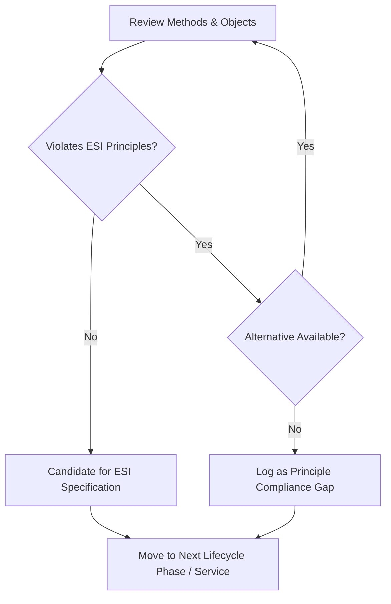

# Guide to Developing Energy Services Interfaces (PNNL-35111) | Project Pillar: Literature Review

**Report Date:** January 2024  
**Review Date:** May 2026  
**Status:** Technical Literature Notes  
**Authors:** R. Brown, J. Liu, B. Nordman (LBNL); J. Kolln, T. Slay, S. Widergren (PNNL); D. Narang (NREL); T. Bohn (ANL); Y. Xue (ORNL)  
**Report Number:** PNNL-35111

---

## 🎯 Executive Summary
This report acts as a practical guide for DER integration practitioners to develop, align, and check communications interface standards and implementation profiles against the **Energy Services Interface (ESI)** concept. Rather than defining a technical standard, it provides a logical evaluation framework utilizing the **GridWise Architecture Council's Interoperability Maturity Model (IMM)**. It defines the ESI tenets, details the five-stage service lifecycle, outlines step-by-step ESI review processes, and applies this methodology to evaluate IEEE Std 2030.5-2018, identifying a critical device-agnostic principle violation.

---

## 🔑 Key Interoperability & Maturity Contributions

### 1. The Interoperability Maturity Model (IMM) for ESI
The guide organizes interoperability criteria into standard categories and grades integration maturity from Level 1 (Ad Hoc) to Level 5 (Optimized) based on Capability Maturity Model Integration (CMMI):
* **Configuration and Evolution (Criteria 1-8):** Resource naming, registries, and discovery. Ensures resources can enter/leave the system without clashes and that profiles can evolve and scale.
* **Security and Safety (Criteria 9-12):** Aligning security policies, maintaining safe grid operation during failure, and cross-boundary troubleshooting.
* **Operation and Performance (Criteria 13-16):** Transaction synchronicity, QoS, and distributed error handling.
* **Organizational (Criteria 17-18):** Policy and business process alignment driving the information exchange.
* **Informational (Criteria 19-21):** Semantic models, schemas, and resource-attribute relationships.
* **Technical (Criteria 22-23):** Message syntax, encoding, physical protocols, and communication medium.

### 2. The Five ESI Lifecycle Phases
Unlike typical utility DER integrations that focus strictly on scheduling and real-time operations, the ESI framework requires supporting a complete lifecycle:
1. **Register and Qualify:** Credentials check, capability query, and program matching.
2. **Schedule:** Establishing prices, quantities, and times of service availability/delivery.
3. **Operate:** Active dispatch, real-time status updates, and alarms.
4. **Measure and Verify (M&V):** Comparing actual telemetry records against baselines or scheduled contracts.
5. **Settle:** Financial clearing, performance scoring, payments, and penalties.

---

## 📐 The ESI Development Process

The guide outlines two distinct review methodologies to ensure ESI compliance and interoperability:

### 1. ESI Principle Compliance Evaluation
Iterates through each grid service and lifecycle phase to ensure communication methods and data objects do not violate ESI tenets:
* **Check 1: Service-Oriented Interface:** Does the message exchange specify *what* is needed, not *how*? Does it avoid targeting specific device types?
* **Check 2: Privacy Preservation:** Does it prevent exposing internal device IDs, states, or topologies?
* **Check 3: Device Agnosticism:** Is it open to any DER technology that can meet the performance requirement?
* *Action:* If a violation is found, alternative methods must be identified, or it must be logged in a gap analysis report.

### 2. Interoperability Maturity Assessment
Evaluates the IMM criteria (1 to 23) across the five lifecycle phases by asking: *"How do we apply the protocol to meet this IMM criterion during this lifecycle phase?"* Gaps in maturity are logged to help standard groups and alliances improve implementation profiles (e.g., CSIP, OpenADR profiles).

---

## 🛠️ Interaction Examples & Abstract Management

### 1. Energy & Reserve Service Interactions
* **Energy Service Flow:** Registers provider -> Requestor posts pricing/schedule -> Provider accepts -> Delivery occurs (no real-time dispatch needed) -> M&V reads meter data -> Settlement billing.
* **Reserve Service Flow:** Registers provider -> Requestor schedules standby capacity -> Delivery performance window is armed -> Requestor sends **dispatch signal (Operate)** -> Provider actuates resources -> Telemetry recorded -> Performance verified and settled.

### 2. IEEE Std 2030.5 example review findings (Appendix A)
The guide reviews IEEE Std 2030.5-2018 against IMM Criterion 7 (Resource Identification) and Criterion 8 (Resource Discovery):
* **Resource Discovery Mapping:** 2030.5 uses DNS-based Service Discovery (DNS-SD), EndDevice registration endpoints (`/edev`), and `DERCapability` to convey characteristics.
* **Critical ESI Principle Violation:** 
  * The `DERCapability::type` element and `DERControl::deviceCategory` filter in IEEE 2030.5 are **non-compliant with the ESI device-agnostic principle** because they target specific DER device classes (e.g., solar PV vs. storage vs. load).
  * **PNNL-35111 Recommendation:** Set `DERCapability::type` to "0" (unknown/not applicable) and set `deviceCategory` bits to all-ones to enforce neutral participation.
  * **Preferred Alternative:** Use the **Flow Reservation** function set (IEEE 2030.5 Section 10.9) which does not use device type identifiers and is naturally device agnostic.

---

## 💡 Connections to EGoT & Dissertation

### 1. Architectural Alignment with EGoT Microservices
The ESI Guide’s analysis of IEEE 2030.5 provides the direct architectural rationale for EGoT's split service topology:

* **Why FlowReservation exists as a standalone service (:8027):**  
  As shown in Appendix A of the Guide, standard IEEE 2030.5 `DERControl` contains device-specific category mappings that violate ESI. EGoT's extraction of `FlowReservation` to a dedicated service isolates the scheduling and reservation phase using the device-agnostic 2030.5 Flow Reservation schemas.
* **Why MUP (:8017) is isolated:**  
  Mirror Usage Point manages the `CustomerAgreement` and `serviceLocation` resources mapped under the IMM Criteria 7 & 8 tables, providing a dedicated telemetry API for M&V and Settle phases.
* **Why DCAP (:8012) handles discovery:**  
  Handles the DNS-SD and root registry discovery processes evaluated under IMM Criterion 8.

### 2. Dissertation Outline Mapping & Gaps
* **Addressing 2030.5 Compliance in EDevice (:8015) & DER (:8026):**  
  To make the EDevice and DER microservices compliant with ESI principles, we must implement the PNNL guide’s recommendation: force `DERCapability::type` to `0` and wildcard `deviceCategory` filters in control handlers to prevent device-specific dispatch.
* **Lifecycle Gaps in Current Standards:**  
  DER integration standards focus strictly on *Schedule* and *Operate*. The dissertation must document how the *M&V* and *Settle* phases are integrated into the ESI (e.g., using Go-based automated billing and performance scoring engines).

---

## 📌 Critical Quotes
> "By being service-oriented, ESI interactions describe what is expected (a service) rather than how the performance expectation or objective is met." (Page 1)

> "The facility management function does not expose the identity or other details of individual DER but rather only the collective capability of all DER in the DER facility for a particular grid-DER service." (Page 4)

> "Interface standards for DER coordination today tend to focus on the Schedule and Operate Phases. Register and Qualify, Measure and Verify, and Settle Phases are seen as more specialized for each deployment. An ESI specification needs to cover all the phases." (Page 7)

> "The DERCapability::type element, described in the schema, is a violation of the device-agnostic principle of the ESI and should be set to '0' to indicate not applicable or unknown." (Page 24)
