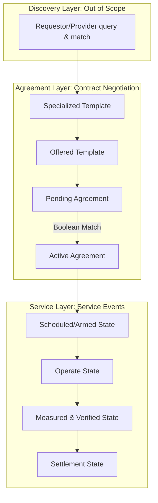

# Energy Services Interface: Architecture, Requirements, and Agreements (PNNL-37019) | Project Pillar: Literature Review

**Report Date:** November 2024  
**Review Date:** May 2026  
**Status:** Technical Literature Notes  
**Authors:** Donald J. Hammerstrom, David J. Sebastian Cardenas, Jaime Kolln  
**Affiliation:** Pacific Northwest National Laboratory (PNNL) for the U.S. Department of Energy (Contract DE-AC05-76RL01830)

---

## 🎯 Executive Summary
This report advances the technical development of the **Energy Services Interface (ESI)**, which serves as a bi-directional, service-oriented, logical interface supporting secure interactions between entities inside and outside a customer facility boundary. The report makes three key contributions:
1. **WS-Agreement Mapping:** Proposes that ESI service agreements be modeled as domain-specific profiles of the Open Grid Forum's **Web Services Agreement (WS-Agreement)** specification.
2. **Three-Layer Behavioral Architecture:** Re-casts the prior flat, five-stage ESI lifecycle into a three-layered behavioral architecture consisting of **Discovery**, **Agreement**, and **Service** layers.
3. **Deterministic Verification:** Offers concrete, deterministic requirements (using Boolean expression trees and JSON Schema) for communication interfaces to automate contract negotiation, performance verification, and settlement.

Due to its performance-driven approach, the ESI is designed to satisfy all common grid needs via only six common ESI service types: **Energy, Reserve, Regulation, Blackstart, Voltage Management, and Frequency Response**.

---

## 🔑 Key Architectural Contributions

### 1. WS-Agreement Profile (JSON-Schema Representation)
* **Rationale:** Traditional utility programs use highly custom, manual contracts. Web Services Agreement (WS-Agreement) standardizes digital service contracts, defining service specifications, guarantee terms, and compliance mechanisms.
* **Simplification for ESI:** ESI specializes WS-Agreement by:
  * Restricting agreements to **exactly two parties** (Service Requestor and Service Provider) to avoid multi-party negotiation complexity.
  * Expressing contract templates and agreements using **JSON-Schema** instead of complex XML/XSD to achieve a balance between human readability and machine automation.
  * Requiring the injection **circuit location** as a core context parameter.

### 2. Three-Layered Behavioral Model
Instead of treating registration, scheduling, operation, and billing as a flat sequence, the report structures these into three independent behavioral layers:
* **Discovery Layer:** Announcements, query mechanisms, and connection establishment.
* **Agreement Layer:** Registration and qualification processes (representing contract negotiation).
* **Service Layer:** routine operations (scheduling, operating, verification, settlement) represented as sub-states of **Service Events**.



### 3. Grid-Centric vs. Service-Oriented (Privacy and Device Agnosticism)
* **Separation of Objectives:** Grid operators' operational objectives ("grid services" like capacity management) lie **outside the scope** of the ESI. The requestor translates its grid objectives into ESI service terms.
* **Asset Privacy:** ESI service providers never share their internal capabilities, resource types, or valuation algorithms. They expose only aggregated capabilities and performance at the connection point (electrical location).
* **Device Agnosticism:** ESI services must never target specific device types. Aggregators or facility managers are responsible for coordinating internal DERs to meet the contract.

---

## 📐 The Three ESI Behavioral Layers

### 3.1 ESI Discovery Layer
* **Scope:** How requestor and provider find one another. It largely lies **outside the scope of the ESI interface specification**.
* **Physical Constraints:** Unlike standard web services, ESI connections are physically constrained. A service provider must reside in the target region of the requestor’s electric circuit (feeder/substation) to provide local grid services.
* **Initial State:** Upon establishing a communication link, a default agreement of **"None—No Service"** is assigned, preventing immediate obligations while enabling future negotiations.

### 3.2 ESI Agreement Layer
Facilitates the contracting process using the ESI service agreement state model:
1. **Templates:** The requestor specializes one of the 6 basic service templates by populating variables (service requirements and guarantee terms) and advertises it.
2. **Evaluation:** The provider imports the template, verifies whether its assets meet the **agreement creation constraints** (prequalifications), fills in its capability variables, and resubmits it as a **Pending ESI Service Agreement**.
3. **Prequalification Decidability:** Prequalification checks must output a Boolean value and be evaluated deterministically using Boolean decision trees (Appendix D).
4. **Execution:** Once the requestor accepts, the agreement becomes **Active (In Force)**. It specifies a contract start time and expiration time, reverting to the default "None" agreement upon termination.

### 3.3 ESI Service Layer
Handles routine operations while an agreement is active. It operates on **Service Events** (objects that migrate through a state machine):
1. **Scheduled or Armed:** delivery interval or contingency is determined.
2. **Operate:** delivery window begins or contingency is met. Resource engagement may or may not involve actual device actuation (e.g., reserve delivery without active discharge).
3. **Measured & Verified (M&V):** participants collect and validate measurements.
4. **Settlement:** participants reconcile performance and exchange rewards/penalties.
* **Service Event Granularity:** Varies dramatically based on the service. A flat reserve standby contract might have **one service event per month**. A fast regulation service tracking 4-second ACE signals might accumulate **~670,000 service events per month**.

---

## 🛠️ Methodological Notes & Interface Requirements

### 1. General & Architectural Requirements
* **Requirement 1.2.1 (Two-Party):** Agreements are restricted to two parties. Multiparty interactions must be broken down into pairwise agreements using techniques like message forwarding and encapsulation.
* **Requirement 1.2.4 & 1.2.5 (Independent Obligations):** A provider's obligation to one contract must not be affected by its commitments to others. Value stacking (participating in multiple ESI agreements) is permitted, but the provider assumes all legal/financial risks of underperformance if services conflict.
* **Requirement 1.2.6 (Circuit Location):** The contract must specify the electrical circuit location (injection point). The requestor is responsible for the locational implications.
* **Requirement 1.2.9 (Push & Pull):** Interfaces must symmetrically support both push (event-driven telemetry, alerts) and pull (asynchronous queries, billing polling) methods.

### 2. Scheduling and Operation
* **Schedule Definition:** One-to-one pairing of a scheduled object (Boolean state, curve, power, price) with a time interval.
* **Requirement 4.1.1.1 (Advance Notice):** Minimum time required to accept a change in a schedule.
* **Availability Status (Provider Owned):** State of readiness of the resources (binary or continuous). Must be pushed immediately if it differs from the schedule.
* **Armament Status (Requestor Owned):** Planning status indicating the condition under which the provider should engage (e.g., if voltage drops below a threshold).
* **Engagement Status (Shared Inference):** Provider asserts if resources are operating; Requestor infers engagement from telemetry.

### 3. Measurement, Verification, and Settlement
* **Determinism:** Service terms, qualifications, and guarantees must be expressed using logical expression trees or deterministic algorithms to ensure machine decidability.
* **Requirement 4.3.3.1 (Shared Metering):** Meter data must be treated as a shared resource and made available to both parties via secure, public endpoints, removing utility-centric metering bottlenecks.
* **Settlement Intervals:** Must be explicitly stated. Dispute periods and remediation steps for disputed performance metrics must be defined in the contract.

---

## 📋 Appendix Reference: Service Qualifications & Signal Objects

### Appendix A: ESI Service Qualifications (CIM Aligned)
To automate matching, qualifications are grouped into standard categories:
* **Circuit Location:** Substation, Feeder, Feeder Phase, Premises circuit.
* **Electrical Qualities:** Nominal voltage (kV), Apparent power (kVA), Current limit (A).
* **Meter Qualities:** Multipliers, accuracy, precision, data access permissions, protocols.
* **Aggregate Energy Flexibility:** Sink (consumption) or Source (generation) capacities, typical/max/min values, temporal patterns, and response delays.
* **Process Capabilities:** Supported message types and granularities (e.g., 15-minute vs. 4-second capacity).

### Appendix B: Signals and Objects needed by the ESI
* **Scheduled/Armed State:** Schedules, time intervals, coordinate-pair **Curves** (Demand curve, Droop curve, Elasticity curve, Strike price, and inverter control curves like Volt-VAR, Volt-Watt, and Constant PF).
* **Operate State Performance Records:** 
  * *Interval performance:* Interval energy (Wh), Real power mileage (integrated absolute real power for storage wear/effort), Power factor, Reactive power mileage.
  * *Event performance:* Engagement duration, event count, overvoltage/undervoltage violations, peak demand, service outage duration.
  * *Signals:* Area Control Error (ACE, 2-4 second interval), local voltage magnitude and frequency.
* **Settlement State:** Cumulative energy, cumulative real/reactive mileage, peak demand, availability durations, service payments.

### Appendix D: Boolean Expression Trees
* Deepest nodes represent variables/constants, parent nodes represent functions/operators (e.g., `sum`, `multiply`, `logical AND`).
* Evaluation is deterministic, executing bottom-up (depth-first) to resolve qualifications or performance scores into clear Boolean or numerical results. Can be cleanly represented in JSON format.

---

## 💡 Connections to EGoT & Dissertation

### 1. Mapping to EGoT Microservices Architecture
The EGoT platform can be mapped directly to the three ESI layers using its microservices fleet:

```
+--------------------------------------------------------------------------------+
|                               DISCOVERY LAYER                                  |
|  - egot/dcap (:8012): Root discovery service for query/matching.               |
+--------------------------------------------------------------------------------+
                                       |
                                       v
+--------------------------------------------------------------------------------+
|                                AGREEMENT LAYER                                 |
|  - egot/edevice (:8015) & egot/der (:8026): Registers devices, qualifications  |
|    (Appendix A), and establishes the ESI contract state machine (JSON-Schema). |
+--------------------------------------------------------------------------------+
                                       |
                                       v
+--------------------------------------------------------------------------------+
|                                 SERVICE LAYER                                  |
|  - egot/derp (:8013): Distributes scheduled Inverter Curves (Volt-VAR, droop). |
|  - egot/flowreservation (:8027): Manages Scheduled/Armed states & Reserves.   |
|  - egot/mup (:8017): Collects Operate and M&V Telemetry (performance records). |
+--------------------------------------------------------------------------------+
```

### 2. Resolving Key Implementation Gaps & Vulnerabilities
A comparison between the PNNL-37019 requirements and the current `egot/lifecycles/` Go implementation highlights several critical tasks for the dissertation:

* **Regulation Service Telemetry Gap:**
  * *Vulnerability:* The current `egot/lifecycles/regulation.md` utilizes the Mirror Usage Point (`MUP`) only for cumulative active energy (`Wh`) billing.
  * *Solution:* Implement **Real Power Mileage** (integrating absolute power changes) and high-frequency (2-4 second) ACE tracking in the MUP and settlement services.
* **Reserve Service Dispatch Trigger:**
  * *Vulnerability:* The `egot/lifecycles/reserve.md` covers capacity scheduling but lacks the active contingency dispatch trigger.
  * *Solution:* Implement the contingency event trigger, tracking the transition from Scheduled/Armed to Operate, and verifying the **Speed of Response** (ramp rate verification).
* **Voltage Management & Frequency Response Telemetry:**
  * *Vulnerability:* EGoT lacks reactive power (`VARh`) telemetry schemas and sub-second event logs to verify autonomous droop curves.
  * *Solution:* Extend `MUP` schemas to support reactive power metrics and introduce event-triggered high-resolution logs.
* **Blackstart Conceptual Realignment:**
  * *Vulnerability:* The current `blackstart.md` in EGoT is modeled as a simple demand-response load-shedding program.
  * *Solution:* Rewrite the lifecycle to reflect true blackstart restoration, including grid-forming (GFM) control triggers, islanding status flags, and sequential feeder restoration sequences.

---

## 📌 Critical Quotes
> "An ESI service agreement defines the performance terms and guarantees of an ESI service, but it must never reveal just how those terms and guarantees are calculated, valued, or procured. Neither the ESI service requestors’ objectives nor the ESI service providers’ means of providing the services are shared across an ESI. The ESI maintains privacy." (Page 10)

> "The ESI is device agnostic. ESI services should never target specific devices or flexible resource types. The ESI is applicable to all types of flexible energy resources that can pass the service qualifications." (Page 10)

> "To enable a balance between human understandability and machine interpretability, this document proposes such a template to be represented using JSON-Schema." (Page 23)

> "Typically, no lone ESI service provider can unilaterally mitigate any grid service, and the grid’s operational objectives are typically irrelevant to the limited actions that the ESI service provider can, in fact, perform." (Page 27)

> "Meter information should be assumed to be shared resource, regardless of whether the ESI service requestor or ESI service provider owns or possess direct access to meters and meter data." (Page 38)
